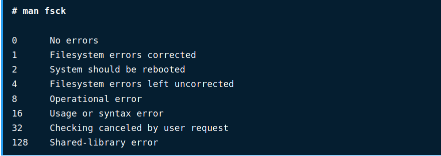

# Filesystem

## Các loại file system phổ biến:

- Gồm có mấy loại ?

    Gồm có 4 loại cơ bản:

    1. File cơ bản : EXT2, EXT3, EXT4,...
    2. File cho cơ sở dữ liệu
    3. File dành cho dạng lưu trữ: thẻ nhớ,...
    4. File dành cho các mục đích đặc biệt: debugfs, procfs,..
- Sử dụng lệnh `fsck` ( FIle system consistency check )để kiếm tra và sửa lỗi file system như thế nào ?
    - Khi nào thì sử dụng ?
        1. Khi hệ thóng không thể bật lên được ( boot )
        2. Khi các file bị lõi ( corrupt)
        3. Khi các bộ nhớ ngoài ( SD card , etc) không hoạt động đúng
    - Cách sử dụng:

        Nhập lệnh `fsck /dir/to/filesys`

        lưu ý phần đường dẫn được kiếm tra phải được unmounted ( tách rời khỏi hệ thống ): cách để unmount: `unmounted dir/to/filesys`

    - Các option được sử dụng:

        Các option có thể được sử dụng như sau:

        1. `-A` : kiếm tra mọi file system
        2. `c` : hiện thanh tiến trình
        3. `l` : khóa hệ thống lại đảm bảo không bị ngắt quãng khi đang thực hiện
        4. `v` : mô tả những hoạt động đang thực hiện
- Kết quả trả về có những loại nào ?

    
