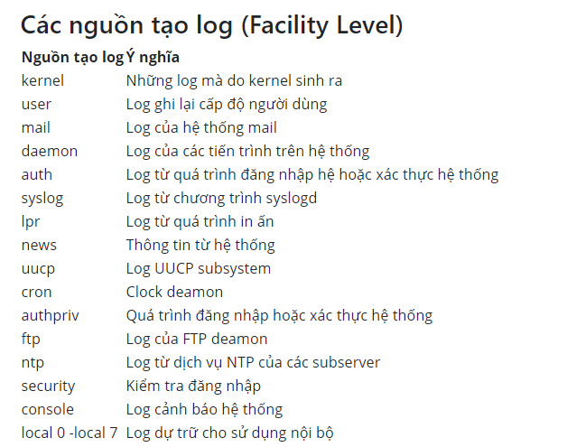

# Syslogd

- Syslog là gì ?
    - Là 1 giao thức xử lí file log
    - File log có thể được lưu tại chính máy đó hoặc tại 1 máy khác
    - Sử dụng port 514
    - Có thể gửi qua UDP hoặc TCP
    - Được gửi ở dạng cleartext
    - Giao thức này được sử dụng bởi Rsyslog
- File config được chứa ở đâu ?
    - Trong UBUNTU file cấu hình là /etc/rsyslog.conf

        → Thấy được nơi config log cơ bản của các service

- Các nguồn tạo log ?
    - kernel
    - user
    - daemon
    - syslog
    - cron
    - ftp

    

- Các mức độ của log ?

    

- Log rotation ?
    - Được sử dụng bởi 1 service mang tên logrotate ( có file config thuộc /etc/logrotate.conf)

        → được sử dụng để giảm thiểu sự cồng kềnh trong việc ghi log của hệ thống

        → các file cũ sẽ được nén lại + thêm tiền tố đằng sau để phân biệt