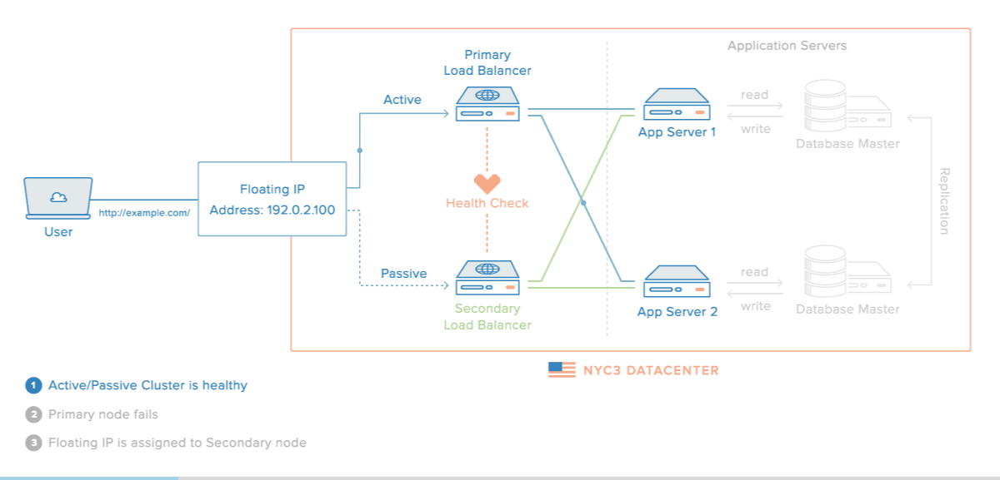

# KEEPALIVED

# 1. Khái niệm về Keepalived



**Keepalived** là ứng dụng trên Linux cung cấp 2 khả năng chính là High Availability và Load Balancing. Tuy nhiên, do tính năng LB của Keepalived không thực sự tốt và hiệu quả bằng 2 ứng dụng nổi tiếng đó là HAProxy và Nginx nên ít được sử dụng. Điểm sáng của Keepalived chính là tính năng HA cung cấp tính sẵn sàng của hệ thống lên mức cao nhất. Giả sử nếu có sự cố thì việc khắc phục chỉ diễn ra trong vòng tích tắc và ngưởi dùng sẽ không thực sự biết được là đã có sự cố xảy ra.

# 2. Cách thức hoạt động của Keepalived


Keepalived hoạt động dựa trên 2 mô hình chính là MASTER - BACKUP hoặc BACKUP - BACKUP

Keepalived sẽ thực hiện gom 1 nhóm máy chủ với nhau, thiết lập giao thức VRRP ( Virtual Redundancy Routing Protocol ) và server nào có mức độ ưu tiên cao nhất sẽ thực hiện vai trò MASTER → nắm giữ địa chỉ VIP (Virtual IP ) được thống nhất giữa các cụm server đó. Và đồng thời server MASTER sẽ gửi bản tin trạng thái của mình theo định kì.

Các kết nối tới cụm server này sẽ chỉ biết tới Virtual IP mà không biết tới IP thực sự của server. Nếu trong trường hợp server MASTER tạm thời không hoạt động thì địa chỉ VIP sẽ được chuyển cho Server có độ ưu tiên thấp hơn. 

Các server thực hiện quảng bá trạng thái của mình qua địa chỉ 224.0.0.18 bằng giao thức VRRP 

# 3. Cách thức cấu hình và cài đặt


Thực hiện xét mô hình như sau:

- 2 Server đã được cài sẵn Nginx

⇒ 2 server này sau khi được thiết lập Keepalived sẽ có chung 1 địa chỉ VIP 

1. Cài đặt dịch vụ Keepalived trên 2 server ( Với Ubuntu 18.04 ) :

    ```bash
    sudo apt install keepalived
    ```

2. 2. Tạo file cấu hình cho Keepalived
    1. Trên server số 1 :

        ```bash
        nvim /etc/keepalived/keepalived.conf
        ```

        ```bash
        vrrp_instance com238 {
          state MASTER
          interface eth1
          mcast_src_ip 123.30.234.238
          priority 200
          virtual_router_id 100
          advert_int 1
          authentication {
                auth_type PASS
                auth_pass 1234
                }
          virtual_ipaddress {
             123.30.234.145
          }
        }
        ```

    2. Trên server số 2 :

        ```bash
        nvim /etc/keepalived/keepalived.conf
        ```

        ```bash
        vrrp_instance com188 {
         state BACKUP
         interface eth1
         mcast_src_ip 123.30.234.188
         advert_int 1
         virtual_router_id 100
         priority 100
         authentication {
                auth_type PASS
                auth_pass 1234
                }
         virtual_ipaddress {
            123.30.234.145
          }
        }
        ```

        - Trong đó có một số mục cần lưu ý như sau:
            - `vrrp_instance` : Mục chứa thông tin về 1 server vật lý
            - `state` : Trạng thái mặc định của Sever ( có thể là MASTER hoặc BACKUP )
            - `interface` : Giao diện mạng được sử dụng
            - `mcast_src_ip` : Địa chỉ mạng thực tế của server
            - `advert_int` : Thời gian gửi bản tin quảng bá
            - `virtual_router_id` : Định danh cho các router thuộc cùng 1 nhóm VRRP.
            - `priority` : Mức độ ưu tiên của server
            - `authentication` : Chỉ định hình thức xác thực trong VRRP. Có thể sử dụng AH hoặc PASS
            - `virtual_ipaddress` : Địa chỉ IP ảo được thiết lập giữa các server
3. Chạy tiên trình Keepalived :

    ```bash
    systemctl start keepalived
    ```

    ```bash
    systemctl enable keepalived
    ```

- Kiểm tra lại trạng thái của 2 server
- Tại Server MASTER

    ```bash
    systemctl status keepalived
    ```

    ```bash
    keepalived.service - Keepalive Daemon (LVS and VRRP)
       Loaded: loaded (/lib/systemd/system/keepalived.service; enabled; vendor preset: enabled)
       Active: active (running) since Sat 2020-09-26 09:54:27 +07; 5h 5min ago
      Process: 577 ExecStart=/usr/sbin/keepalived $DAEMON_ARGS (code=exited, status=0/SUCCESS)
     Main PID: 602 (keepalived)
        Tasks: 3 (limit: 2339)
       CGroup: /system.slice/keepalived.service
               ├─602 /usr/sbin/keepalived
               ├─603 /usr/sbin/keepalived
               └─604 /usr/sbin/keepalived

    Sep 26 09:54:26 ubuntu-1vcpu-2gb-01-03 Keepalived_healthcheckers[603]: Opening file '/etc/keepalived/keepalived.co
    Sep 26 09:54:27 ubuntu-1vcpu-2gb-01-03 Keepalived_vrrp[604]: Registering Kernel netlink reflector
    Sep 26 09:54:27 ubuntu-1vcpu-2gb-01-03 Keepalived_vrrp[604]: Registering Kernel netlink command channel
    Sep 26 09:54:27 ubuntu-1vcpu-2gb-01-03 Keepalived_vrrp[604]: Registering gratuitous ARP shared channel
    Sep 26 09:54:27 ubuntu-1vcpu-2gb-01-03 Keepalived_vrrp[604]: Opening file '/etc/keepalived/keepalived.conf'.
    Sep 26 09:54:27 ubuntu-1vcpu-2gb-01-03 Keepalived_vrrp[604]: Using LinkWatch kernel netlink reflector...
    Sep 26 09:54:27 ubuntu-1vcpu-2gb-01-03 Keepalived_vrrp[604]: VRRP_Instance(com238) Transition to MASTER STATE
    Sep 26 09:54:28 ubuntu-1vcpu-2gb-01-03 Keepalived_vrrp[604]: VRRP_Instance(com238) Entering MASTER STATE
    Sep 26 09:54:26 ubuntu-1vcpu-2gb-01-03 systemd[1]: Starting Keepalive Daemon (LVS and VRRP)...
    Sep 26 09:54:27 ubuntu-1vcpu-2gb-01-03 systemd[1]: Started Keepalive Daemon (LVS and VRRP).
    ```

- Tại server BACKUP

    ```bash
    systemctl status keepalived
    ```

    ```bash
    keepalived.service - Keepalive Daemon (LVS and VRRP)
       Loaded: loaded (/lib/systemd/system/keepalived.service; enabled; vendor preset: enabled)
       Active: active (running) since Sat 2020-09-26 09:25:36 +07; 5h 35min ago
      Process: 24457 ExecStart=/usr/sbin/keepalived $DAEMON_ARGS (code=exited, status=0/SUCCESS)
     Main PID: 24458 (keepalived)
        Tasks: 3 (limit: 2339)
       CGroup: /system.slice/keepalived.service
               ├─24458 /usr/sbin/keepalived
               ├─24459 /usr/sbin/keepalived
               └─24460 /usr/sbin/keepalived

    Sep 26 09:25:36 ubuntu-1vcpu-2gb-01-01 Keepalived_vrrp[24460]: Using LinkWatch kernel netlink reflector...
    Sep 26 09:25:36 ubuntu-1vcpu-2gb-01-01 Keepalived_vrrp[24460]: VRRP_Instance(com188) Entering BACKUP STATE
    Sep 26 09:30:55 ubuntu-1vcpu-2gb-01-01 Keepalived_vrrp[24460]: VRRP_Instance(com188) Transition to MASTER STATE
    Sep 26 09:30:56 ubuntu-1vcpu-2gb-01-01 Keepalived_vrrp[24460]: VRRP_Instance(com188) Entering MASTER STATE
    Sep 26 09:31:21 ubuntu-1vcpu-2gb-01-01 Keepalived_vrrp[24460]: VRRP_Instance(com188) Received advert with higher p
    Sep 26 09:31:21 ubuntu-1vcpu-2gb-01-01 Keepalived_vrrp[24460]: VRRP_Instance(com188) Entering BACKUP STATE
    Sep 26 09:52:50 ubuntu-1vcpu-2gb-01-01 Keepalived_vrrp[24460]: VRRP_Instance(com188) Transition to MASTER STATE
    Sep 26 09:52:51 ubuntu-1vcpu-2gb-01-01 Keepalived_vrrp[24460]: VRRP_Instance(com188) Entering MASTER STATE
    Sep 26 09:54:25 ubuntu-1vcpu-2gb-01-01 Keepalived_vrrp[24460]: VRRP_Instance(com188) Received advert with higher p
    Sep 26 09:54:25 ubuntu-1vcpu-2gb-01-01 Keepalived_vrrp[24460]: VRRP_Instance(com188) Entering BACKUP STATE
    ```

    ### **Việc cài đặt và cấu hình 2 server sử dụng Keepalived đã hoàn tất**

    ---

    ## Nguồn tham khảo

    [acassen/keepalived](https://github.com/acassen/keepalived)

    [Terminology - Keepalived 1.4.3 documentation](https://www.keepalived.org/doc/terminology.html)

    [Managing Failovers with Keepalived & HAproxy](https://medium.com/@sliit.sk95/managing-failovers-with-keepalived-haproxy-c8de98d0c96e)

    [Setup Active-Passive Cluster with Keepalived & HAProxy (Two raspberry pis)](https://www.youtube.com/watch?v=NizRDkTvxZo)

    [Keepalived là gì? Tìm hiểu dịch vụ Keepalived High Availability - Technology Diver](https://cuongquach.com/keepalived-la-gi-tim-hieu-dich-vu-keepalived-high-availability.html)

    [Triển khai dịch vụ High Available với Keepalived + HAproxy trên server Ubuntu](https://viblo.asia/p/trien-khai-dich-vu-high-available-voi-keepalived-haproxy-tren-server-ubuntu-jOxKdqWlzdm)

    [Hướng dẫn cấu hình Keepalived thực hiện IP Failover cho hệ thống High Avaiability - Technology Diver](https://cuongquach.com/cau-hinh-keepalived-thuc-hien-ip-failover-he-thong-ha.html)

    [[High Available] Sử dụng Keepalived (kết nối dự phòng) kết hợp với haproxy (cân bằng tải).](https://vietvang.net/high-available-su-dung-keepalived-ket-noi-du-phong-ket-hop-voi-haproxy-can-bang-tai/)

    [Setting up a Linux cluster with Keepalived: Basic configuration](https://www.redhat.com/sysadmin/keepalived-basics)