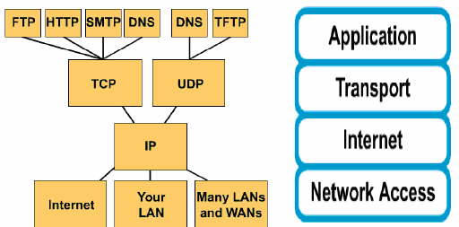

# PROTOCOLS



Sau khi đã có cái nhìn và hiểu biết cơ bản về mô hình OSI và TCP/IP thì việc tìm hiểu về các giao thức thuộc các lớp này sẽ cung cấp cái nhìn sâu hơn về cách thức hoạt động của mạng. Sau đây chúng ta sẽ tìm hiểu các giao thức như : http, arp, smtp , dhcp , ...

# 1. HTTP


HTTP là viết tắt của Hyper Text Transfer Protocol. Đây là phương thức truyền tải dữ liệu giữa 2 máy tính trong mô hình Client-Server ( Sử dụng port 80 ) dùng trong WWW. Clients thường là các trình duyệt trên máy tính còn Server thường là các máy tính trên hệ thống cloud. Đây là giao thức tại tầng ứng dụng trong tập giao thức mạng TCP/IP.

## 1.1 HTTP Request


Việc này được thực hiện khi trình duyệt yêu cầu 1 nội dung nào đó tới Web Server. 1 HTTP Request bao gồm :

1. HTTP version
2. URL 
3. HTTP request header
4. HTTP request body ( Nếu cần )
5. HTTP method

### 1.1.1 HTTP method


HTTP method ám chỉ hành động của browser khi muốn thực hiện 1 yêu cầu nào đó tới Web Server. Trong đó 2 method thường được sử dụng nhất là `GET` và `POST`. Trong đó `GET` để thực hiện lấy thông tin từ Server còn `POST` để gửi thông tin từ người sử dụng lên Web Server.

Ngoài ra còn các Method khác như `PUT` `DELETE` `HEAD` ... 

### 1.1.2 HTTP request header

HTTP header bao gồm các thông tin về cách thức trao đổi dữ liệu giữa Client và Server. Thường chứa các thông tin như loại trình duyệt, yêu cầu, ... Ví dụ 1 HTTP header trong chrome


### 1.1.3 HTTP Body

Là nơi chứa các thông tin đi kèm theo các Method nếu có. Ví dụ như với method `POST` thì body đi theo sẽ bao gồm : tên đăng nhập, mật khẩu, ....

## 1.2 HTTP Response


Là hoạt động trả lời yêu cầu của người sử dụng từ Server. Thường 3 gồm 3 trường sau:

1. HTTP status code
2. HTTP response header 
3. HTTP response body ( nếu cần )

### 1.2.1 HTTP Status code


Được chia làm 5 loại code trả về cho người dùng

1. 1xx : Loại code báo về các thông tin về cho Clients 
2. 2xx : Loại code trả về trạng thái thành công cho Clients
3. 3xx  : Loại code trả về trạng thái chuyển tiếp cho Clients
4. 4xx : Loại code trả về trạng thái lỗi cho Clients với lỗi xảy ra ở bên Clients
5. 5xx : Loại code trả về trạng thái thành công cho Clients với lỗi xảy ra ở bên Server

( Với xx : từ 0 đến 99 )

Ví dụ : Khi thực hiện tải thành công 1 nội dung Web thì sẽ được trả về code 200 → Thực hiện Request thành công

### 1.2.2 HTTP Response header

Gần giống với Header của của quá trình Request thì ở Response header sẽ chứa các thông tin như loại dữ liệu, loại mã hóa, trạng thái ... Ví dụ 


### 1.2.3 HTTP response body


Chứa các thông tin đi kèm theo method để trả lại thông tin phù hợp về với Clients .Ví dụ khi nhận được request GET thì phần body đi kèm sẽ là các thông tin được yêu cầu, thường là các file html, css,js,...

---

# 2. DNS


DNS ( Domain Name System ) là giao thức cho phép chuyển đổi tên miền ( Domain Name ) thành địa chỉ IP. Khác với con người làm việc với các cái tên như google, youtube,... thì máy tính chỉ làm việc với các con số, ví dụ như: 8.8.8.8 , 192.168.123.230 , ....

Để tránh việc phải nhớ từng địa chỉ IP của từng trang web cụ thể, thì người ta sử dụng tên miền giúp cho người sử dụng internet dễ nhớ 

→ Đòi hỏi 1 giao thức có thể cung cấp khả năng dịch tên miền sang địa chỉ ip hoặc ngược lại.

## 2.1 Cách thức DNS hoạt động

Khi User thực hiện nhập địa chỉ web tại trình duyệt thì đầu tiên nó sẽ kiểm tra xem tên miền này có thuộc trong cache trên máy tính hay không. Nếu việc thực hiện tìm kiếm không có kết quả, sau đó được chuyển tới các Server sau:

### 2.1.1 DNS Resolver :


Đây là Server thường trực thực hiện nhiệm vụ phân giải tên miền cho máy tính của chúng ta. Nếu máy tính không biết về tên miền vừa được nhập. Yêu cầu này sẽ được chuyển tới cho Recursive Resolver ( Đây là server DNS chấp nhận các yêu cầu recursive - đệ quy - từ phía người dùng ) để thực hiện. DNS Resolver sẽ tìm kiếm trong kho lưu trữ cache của nó, nếu không tìm được kết quả phù hợp thì yêu cầu lại được tiếp tục chuyên tới Root Name Server . 

### 2.1.2 Root Name Server :

Đây là hệ thống quan trọng trong sơ đồ name server. Trong thực tế, sau khi nhận được yêu cầu thì RNS sẽ thực hiện phản hồi về TLD ( Top-level Domain ) phù hợp để cho Resolver thực hiện chuyển tiếp. Tại đây thường không trực tiếp cung cấp địa chỉ IP của tên miền


### 2.1.3 Top-level Domain


Đây là nơi lưu thông tin về các địa chỉ như: .org, .vn, .net , .... ví dụ với [facebook.com](http://facebook.com) thì nó sẽ thuộc về TLD quản lý phần mở rộng `.com` , tương tự với các web khác. 

Tại đây sau khi nhận được yêu cầu của Resolver nó sẽ thực hiện hồi đáp với địa chỉ của Authorative Nameserver → tại đó sẽ có địa chỉ web chính xác cần tìm.

### 2.1.4 Authorative Nameserver

Đây chính là điểm cuối cùng để tìm kiếm địa chỉ mạng. Đây là nơi cung cấp địa chỉ tên miền đang gắn với địa chỉ nào. 


Sau khi nhận được phản hồi từ A.N thì Resolver sẽ đưa trả kết quả này về với máy tính của người sử dụng. Được minh họa như sau:


### 2.1.5 Các loại DNS query :

Bao gồm 3 loại Query chính như sau

1. Recursive Query : Được thực hiện giữa Clients và Resolver. Clients sẽ yêu cầu DNS Server trả về địa chỉ IP cần tìm
2. Iterative Query : Đây là trường hợp và DNS Resolver không có kết quả có sẵn với tên miền cần tìm và nó sẽ trả về kết quả cho Clients sau khi nhận lại được kết quả từ các Server khác.
3. Non - iterative Query : Đây là trường hợp khi DNS có sẵn kết quả được lưu trong cache và trả kết quả trực tiếp cho Clients. Thường thì các Resolver sẽ thực hiện điều này để giảm lưu lượng băng thông sử dụng

---

# 3. FTP / SFTP


FTP là viết tắt của File Transfer Protocol. Có nhiệm vụ chính là truyền hoặc nhận file. Cơ cấu hoạt động theo mô hình Clients / Server cho phép truyền dữ liệu dù không thuộc cùng 1 mạng LAN. 


## 3.1 Mô hình hoạt động

FTP cung cấp 2 mô hình hoạt động trên 2 tiến trình TCP logic là Control Connection và Logic Connection :


Trong đó :

- Control Connection : Thực hiện việc truyền đi các tập lệnh. Kết nối này sẽ luôn mở trong suốt phiên làm việc
- Data Connection : Thực hiện truyền đi các dữ liệu giữa 2 máy. Kết nối sẽ kết thúc sau khi truyền xong

## 3.2 Các phương thức truyền

FTP cung cấp cho người sử dụng 3 phương thức truyền chính theo nhu cầu

1. Stream mode : Dữ liệu được truyền đi dưới dạng các byte không liên tiếp. Một máy sẽ thực hiện truyền dữ liệu qua kết nối TCP trong suốt phiên làm việc
2. Block mode : Dữ liệu được chia nhỏ thành các block để truyền đi. Mỗi block chứa thông tin về dữ liệu đang gửi đi
3. Compressed mode : Sử dụng mã hóa độ dài chạy RLE để rút ngắn lượng dữ liệu truyền đi

⇒ **Nhược điểm** : FTP là 1 phương thức truyền file không bảo mật. Dữ liệu được truyền đi dưới dạng text không được mã hóa → FTP chỉ nên được áp dụng trong một số trường hợp cụ thể hoặc được sử dụng trong mạng bảo mật ( Trusted Network ) → SFTP ( Secured FTP ) ra đời → Dữ liệu sẽ được truyền trong 1 secure shell → tăng tính bảo mật. 

---

# 4. DHCP

Giả sử trong 1 hệ thống mạng lớn, có từ 100 tới 200 máy, việc thiết lập địa chỉ IP tĩnh trên toàn bộ các máy với quản trị viên hệ thống là 1 nhiệm vụ vất vả và tốn thời gian. Dựa trên vấn đề đó, phương thức DHCP đã ra đời. DHCP là viết tắt của Dynamic Host Configuration Protocol. Nhiệm vụ chính của nó là việc cung cấp địa chỉ IP động cho tất cả các máy nối tới mạng cùng với đó có thể cung cấp thêm cả Default Gateway, Subnet Mask,..


Sau đây chúng ta sẽ đến với 1 vài khái niệm cơ bản của DHCP 

## 4.1 Kiến trúc của DHCP

Kiến truc cơ bản của DHCP bao gồm: DHCP clients, DHCP Server, DHCP relay, DHCP lease

**DHCP Clients** : Bất kì thiết bị nào kết nối Internet và có thể giao tiếp với DHCP

**DHCP Server** : Một loại thiết bị được cấu hình để chạy DHCP và cung cấp địa chỉ IP với các thiết bị gửi yêu cầu tới nó

**DHCP relay** : Thường được sử dụng trong các mạng lớn, có nhiệm vụ chuyển tiếp yêu cầu địa chỉ của các thiết bị tới DHCP Server

**DHCP Lease** : Khoảng thời gian trước khi địa chỉ IP bị thay đổi ( Có thể được gia hạn hoặc đổi mới )

## 4.2 Vai trò và Ưu nhược điểm của DHCP

**Vậy tại sao chúng ta phải sử dụng DHCP ?** 

Việc trả lời câu hỏi như vậy sẽ được trả lởi qua việc phân tích Ưu và Nhược điểm của DHCP

**Ưu điểm**

- Cung cấp địa chỉ IP linh hoạt thông qua IP pool có thể được thiết lập trên Server
- Đảm bảo hiện tượng trùng lặp IP trên cùng 1 hệ thống là nhỏ nhất
- Tiết kiệm thời gian quản lý cho người quản trị hệ thống
- Với các thiết bị di động thì nhờ có DHCP xuất hiện ở mọi nơi nên sẽ không có hiện tượng không có địa chỉ IP → Không kết nối được Internet

**Nhược điểm**

- DHCP có thể không phù hợp với các thiết bị không di động như máy in, Server
- DHCP thường được sử dụng trong mạng có quy mô nhỏ, không hoàn toàn phù hợp với quy mô mạng lớn

*Sau khi đã có cái nhìn tổng quan về DHCP thì chúng ta sẽ đi sâu hơn 1 chút để tìm hiểu quá trình DHCP cung cấp địa chỉ IP*

## 4.3 Quá trình cung cấp IP

Việc này diễn ra thông qua 4 bước cơ bản 

1. DHCP DISCOVER : Thiết bị Clients khi kết nối tới mạng sẽ gửi bản tin broad cast để tìm kiếm DHCP Server
2. DHCP OFFER : DHCP Server nhận được bản tin, tìm kiếm địa chỉ còn khả thi trong IP pool → phản hồi Clients 
3. DHCP REQUEST : Clients nếu chấp nhận địa chỉ IP sẽ gửi bản tin này lại cho Server ( Do đã có IP nhận được ở bước 2 )
4. DHCP ACK : Máy Server chấp nhận Request của Clients và cung cấp các tham số để máy Clients có 1 địa chỉ IP trong mạng

---

# 5. SMTP - IMAP/POP

## 5.1 SMTP


Simple Mail Transfer Protocol ( SMTP ) là phương thức sử dụng chuẩn TCP/IP để thực hiện việc gửi email từ Clients tới Server. Nó thiết lập kết nối giữa Clients và SMTP Server để gửi mail. Sau đó, các SMTP này sẽ giao tiếp với các DNS Server để tìm ra địa chỉ của host của Mail Server đích ( quá trình này có thể lặp lại nhiều lần ) rồi chuyển tiếp mail tới Server đó. 

Đối với phía nhận, sẽ thực hiện truy cập Mail Server rồi sử dụng IMAP hoặc POP để tiến hành nhận mail ( tải file kèm theo nếu có )


SMTP sử dụng 2 port sau :

- Port 25 : Port không mã hóa
- Port 456/587 : Port được mã hóa hay còn được gọi là SMTPS

## 5.2 IMAP / POP


Đây là giao thức tiến hành giao tiếp với server Mail và có thể lựa chọn tải email về nếu ngưởi sử dụng có nhu cầu. 

### 5.2.1 POP


Là viết tắt của Post Office Protocol. Thuộc tầng ứng dụng trong mô hình TCP/IP , sử dụng để lấy email từ Server Mail thông qua các kết nối TCP/IP. 

POP3 được sử dụng rộng rãi trong các hệ thống như: Outlook, Thundermail, Gmail,...

Các port được sử dụng bởi POP:

- Port 110 : Port không mã hóa
- Port 995 : Port mã hóa - POP3S

### 5.2.2 IMAP


Giao thức này có đôi chút khác biệt với POP là việc nó sẽ không tải toàn bộ email về máy của Client mà thay vào đó sẽ chỉ tải tiêu đề.

Nhưng cơ bản vẫn sử dụng để phục vụ nhu cầu giống POP

Các port được sử dụng bởi IMAP:

- Port 143 : Port không mã hóa
- Port 993 : Port mã hóa - IMAPS

---

# 6. ARP


Khi thực hiện chuyển tiếp gói tin trong hệ thống Internet thì nhưu chúng ta đã biết địa  chỉ IP sẽ được sử dụng. Tuy nhiên trong hệ thống mạng LAN thì các máy tính lại không giao tiếp với nhau trực tiếp qua địa chỉ IP ma thông qua địa chỉ MAC. Do mỗi máy tính chỉ có một địa chỉ MAC→Đảm bảo truyền chính xác gói tin mà không gửi nhầm. 

Mỗi khi ARP thực hiện request thành công thì nó sẽ tiến hành lưu lại cache để các tiết kiệm thời gian cho các lần truy cập sau. Ta có thể thực hiện xem arp cache thông qua lệnh `arp -a` :

```bash
tuananh@tuananh-Inspiron-5567:~$ arp -a
? (10.128.128.128) at e0:cb:bc:34:35:58 [ether] on wlp2s0
_gateway (192.168.64.1) at ac:1f:6b:2d:f1:74 [ether] on wlp2s0
```

## 6.1 Định nghĩa ARP


Address Resolution Protocol là 1 giao thức tại Layer 2 trong mô hình OSI. Có nhiệm vụ phân giải địa chỉ IP sang địa chỉ MAC duy nhất của các thiết bị. Do các đặc tính này nên ARP được sử dụng chính trong các mạng LAN để phục vụ truyền tin. ARP có 2 loại là Dynamic và Statc: Địa chỉ dạng Dynamic sẽ được xóa theo định kì còn ngược lại là địa chỉ Dạng Static do người quản trị thiết lập và sẽ không bị xóa nếu không nhận được yêu cầu. 

## 6.2 Các bước hoạt động của ARP


Giả sử xét mô hình Client - Server thuộc cùng mạng LAN;  1 Client muốn gửi tin tới 1 Server nhưung không có địa chỉ MAC tương ứng với IP của Server ( Địa chỉ này không có trong bảng ARP )

- Bước 1 :
    - Clients sẽ thực hiện 1 bản tin Broadcast trong đó có địa chỉ IP của Server còn địa chỉ MAC sẽ là ff:ff:ff:ff:ff:ff
- Bước 2 :
    - Bản tin được đẩy qua Switch và tại đây Switch sẽ gửi bản tin cho tất cả các máy thuộc mạng LAN
    - Đối với các máy không có địa chỉ IP này sẽ tiến hành DROP bản tin

    → Không xảy ra hiện tượng gửi nhầm bản tin

    - Đối với Server có địa chỉ IP tương ứng với DestIP thì sẽ tiến hành gửi trả phản hồi lại cho Client kèm theo địa chỉ MAC của nó
- Bước 3 :
    - Máy Client nhận được phản hồi, tiến hành gửi bản tin
    - Update bảng ARP cache để tiết kiệm thời gian gửi sau này

---

# 7. SNMP


Là giao thức tại tầng ứng dụng thuộc tầng 7 của mô hình OSI được xây dụng nên để phục vụ nhu cầu giám sát một hệ thống mạng lớn. Được áp dụng trong hầu hết các hệ thống hiện nay để đảm bảo sự giám sát và từ đó cung cấp được chất lượng dịch vụ tốt nhất tới các Clients

SNMP cung cấp ngôn ngữ chung cho các thiết bị như: router, switch tới các thiết bị đầu cuối đơn giản như PC hay Laptop.

SNMP bao gồm 3 phiên bản là: V1,V2c và v3. Điểm nổi bật của V3 đó chính là việc nó khắc phục được nhược điểm của 2 phiên bản trước: Việc authenticator từ thiết bị giám sát tới các thiết bị bị giám sát được thông qua 1 community string và việc truyền đi dãy thông tin đó không hề được mã hóa. Nếu trong một mạng bảo mật và đáng tin cậy thì việc này không xảy ra vấn đề quá lớn. Tuy nhiên khi việc truyền đi là giữa 2 mạng khác nhau thì việc này gây ra một lỗ hổng bảo mật nghiêm trọng. Nếu hacker có thể lấy được community string thì việc mất toàn bộ hệ thống là hoàn toàn có thể

SNMP thực hiện quản lý hệ thống qua NMS ( Network Managing System ) - nơi mà các agent cũng sẽ được kết nối tới.

**Ưu điểm** :

- Đặc biệt hữu ích trong các hệ thống mạng có quy mô lớn
- Việc giám sát dữ liệu có thể diễn ra theo 2 cách Poll / Trap ( Sẽ được đề cập bên duới )
- Tạo ra các cảnh báo giúp người quản trị hệ thống có thể dự đoán và đưa ra các giải pháp phù hợp
- Thay đổi các thông số tùy theo tình hình cụ thể


## 7.1 Các thành phần quản lý của SNMP

1. SNMP Agent : Chương trình này được chạy trên các thiết bị cần được giám sát. Thực hiện cung cấp các số liệu về với máy chủ quản lý nếu nhận được yêu cầu. Hoặc có thể được cấu hình để thông báo mọi thay đổi tới người quản trị 
2. Các tài nguyên, thiết bị do SNMP quản lý : Các node có agent chạy trên đó
3. Trình quản lý SNMP ( NMS ) : Trình quản lý các Agent. Được cung cấp các thông số thường xuyên hoặc khi có nhu cầu. 
4. Object ID (OID) : Một thiết bị có thể cung cấp nhiều thông tin khác nhau như: Thông tin hệ thống, số port, mức sử dụng CPU,... Tất cả những thông tin như vậy được gọi là 1 Object. Mỗi Object sẽ có 1 ID cụ thể. Nếu có trường hợp 1 thiết bị có nhiều Object thì các Object sẽ được phân biệt với nhau bằng sub-id. Ví dụ như Sysname có ID 1.3.6.1.5.9.6 thì Sysname.0 sẽ có ID 1.3.6.1.5.9.6.0 còn Sysname.1 sẽ có ID  1.3.6.1.5.9.6.1. Thường thi các thông số này các nhà cung cấp thiết bị đã thiết lập sẵn, bạn có thể tra cứu OID trên thư mục Docs.

    *Lưu ý: Các Object nằm liền kề nhau không được sắp xếp theo thứ tự*

    

5. Cơ sở thông tin quản lý (MIB) : Cơ sở dữ liệu chứa thông tin của các thiết bị chạy Agent. Là tập hợp của các tham số OID với mỗi thiết bị sẽ có đường truy xuất OID khác nhau.

    

## 7.2 Poll - Trap

Có 2 cơ chế nhận thông báo trong SNMP đó chính là Poll và Trap. Đây là 2 cơ chế hoàn toàn khác biệt nhau, tuy nhiên, ta hoàn toàn có thể kết hợp sử dụng cả 2 phương pháp trên cùng một hệ thống, bảng so sánh giữa Poll và Trap ( hay có thể được gọi là Alert ) :


## 7.3 Cơ chế hoạt động của SNMP


Một thiết bị hiểu được và hoạt động tuân theo giao thức SNMP được gọi là “có hỗ trợ SNMP” (SNMP supported) hoặc “tương thích SNMP” (SNMP compartible). 

Một máy máy chủ quản lý ( Network Managing Station - NMS ) có thể quản lý được nhiều các Agent khác nhau. Và 1 Agent có thể thuộc sự quản lý bởi 2 NMS khác nhau. Nếu cả 2 NMS thực hiện gửi lệnh tới Agent thì nó sẽ thực hiện từng lệnh theo thứ tự thời gian

SNMP có thể thực hiện vố số các thay đổi khác nhau lên hệ thống và đa số thực hiện qua cơ chế push-pull giữa các thiết bị mạng và thiết bị quản lý. NMS thường là nơi khởi tạo các yêu cầu ( Request ) và các thiết bị mạng gửi phản hồi Response. Các loại phương thức thường gặp của SNMP: 

- **GetRequest** : Tại NMS gửi yêu cầu để lấy 1 số thông tin (OID) từ các Agent thuộc mạng. Ví dụ GetRequestOID=1.3.6.5.1.2 → Agent nhận được và trả lời trạng thái tương ứng với OID
- 1 GetRequest có thể chứa nhiều OID khác nhau → Cùng 1 Request có thể lấy về nhiều thông tin khác nhau
- **GetNextRequest:** Được sử dụng để lấy thông số liền kề với OID được nhập vào. Do đặc điểm cơ chế cây của MIB → Các object liền nhau không theo thứ tự → Việc gửi các GetNextRequest liên tiếp sẽ lấy được các thông số của Agent
- **GetResponse** : Thường do bên Agent gửi trả lại cho bên NMS kèm theo các thông số được yêu cầu ở bản tin GetRequets trước đó
- **Trap** : Agent tự động gửi Trap cho NMS khi có sự thay đổi với Object.  Trap khác với cơ chế SMNP Request / Response → 2 phương thức này để quản lý trong khi đó Trap đặc thù là để cảnh báo. Loại Trap sẽ được thể hiện trong bản tin Trap. Thông thường có 7 loại Trap khác nhau được chia làm 2 loại là Generic ( Đặc thù ) và Specific ( Được người dùng cấu hình ) :

    

    Các thông báo loại Generic

    - coldStart ( 0 ): Thiết bị đang tiến hành khởi động lại và cấu hình có thể thay đổi
    - warmStart ( 1 ): Thiết bị đang tiế hành khởi động lại và giữ nguyên cấu hình
    - linkDown(2): Đường kết nối truyền thông đang gặp lỗi ( Có thể kèm theo ifIndex )
    - linkUp(3): Đường kết nối truyền thông đã được khôi phục ( Có thể kèm theo ifIndex )
    - authenticationFailure(4): Thông báo khi nhận được 1 bản tin không chứng thực từ các giao thức như ftp,ssh,telnet, .. → Thường do người sử dụng đăng nhập không thành công vào thiết bị
    - egpNeighborloss(5): Khi hàng xóm ( trong giao thức EGP) đã mất kết nối thì sẽ gửi thông bá này cho NMS

    Thông báo dạng Specific

    - enterpriseSpecific(6): được tạo bởi người dùng

        ⇒ Người dùng có thể tạo các thông báo như: cpuTooHot, disk90Full, etc 

    Thiết bị gửi Trap sẽ được gọi là Trap Sender còn thiết bị nhận là Trap Receiver. Một thiết bị Trap Sender có thể cấu hình để gửi trap đến nhều các Trap Receiver khác nhau. 

    Để hiểu được ý nghĩa các các Specific Trap thì cả Sender và Receiver sẽ phải có cùng MIB

Các bản tin Trap gửi đi sử dụng port 161 còn bản tin Trap nhận được sử dụng port 162 

## 7.4 Các cơ chế bảo mật


Được chia làm 3 cơ chế bao gồm : Community String , View và Access Control List.

### 7.4.1 Community String:

Được thiết lập giữa NMS và các Agent, thường được sử dụng tại các phiên bản V1 và V2C. Được chia làm 3 loại nhỏ hơn là : Read - Community , Write - Community và Trap Community

Khi NMS gửi bản tin GetRequest thì trong bản tin có chứa Read - Community. Tại bên nhận nếu so sánh có trùng Community String thì sẽ tiến hành gửi bản tin phản hồi chứa thông số được yêu cầu. 

Còn khi gửi bản tin SetRequest thì trong bản tin có chứa Write - Community. Quá trình ở bên nhận tương tự như trường hợp trên. Nếu chấp nhận thì sẽ tiến hành chỉnh sửa OID.

Đối với bản tin Trap. Nếu 2 bên có cùng Trap - Community thì sẽ tiến hành nhận bản tin Trap. Cũng có 1 số trường hợp các Trap Receiver tiến hành nhận mọi bản tin Trap mà không quan tâm đến Community String.

Trên một hệ thống có thể tồn tại nhiều Read/Write/Trap - Community String khác nhau. 

Tuy nhiên quá trình truyền Community String lại ở dưới dạng clear text hay còn được hiểu là không bảo mật. Vậy khi bị lộ Community String thì việc mất quyền kiểm soát vào tay Hacker là hoàn toàn có thể 

### 7.4.2 View:

Nếu như NMS có Read-Community thì có thể có quyền đọc được toàn bộ OID của Agent. Tuy nhiên, các Agent có thể quy định các OID có thể xem được thông qua việc set các View

Một View sẽ gắn liền với 1 Community. Giả sử trường hợp: Agent gắn interfaceVew - "inf" và storageView - "sto":

- Các NMS có Community String "inf" yêu cầu interfaceView thì sẽ được Agent response nhưng khi yêu cầu storageView thì sẽ không được Response do không có Community "sto"

### 7.4.3 SNMP ACL ( SNMP Access Control List )

Tại các Agent có thể thiết lập các ACL để thực hiện chấp nhận kết nối từ những NMS có địa chỉ IP xác định. Việc này được áp dụng đề phòng trường hợp khi Community String bị lộ, thì việc truy cập dữ liệu của các Agent sẽ bị từ chối nếu địa chỉ truy cập khác trong ACL. Từ đó gia tăng tính bảo mật của hệ thống

## 7.5 Cấu trúc bản tin SNMP


- Version : v1 = 0 ; v2c =1; v2u; v3 = 2
- Phần data được gọi là PDU ( Protocol Data Unit )
    - Bản tin Trap sử dụng TRAP PDU
    - Các định khác sử dụng định dạng PDU

---

## Nguồn tham khảo :

---

[](https://www.cloudflare.com/learning/ddos/glossary/hypertext-transfer-protocol-http/)

[Http là gì? Tìm hiểu về giao thức Http và Https](https://www.digistar.vn/http-la-gi-tim-hieu-ve-giao-thuc-http-va-https/)

[What is HTTP](https://www.w3schools.com/whatis/whatis_http.asp)

[Tìm hiểu về HTTP (HyperText Transfer Protocol)](https://viblo.asia/p/tim-hieu-ve-http-hypertext-transfer-protocol-bJzKmgewl9N)

[](https://www.cloudflare.com/learning/dns/what-is-dns/)

[DNS là gì? Cách sử dụng và trỏ tên miền với các loại DNS server](https://mona.media/dns-la-gi/)

[Điều gì sẽ xảy ra từ khi nhập một tên miền vào trình duyệt đến khi trang được hiển thị?](https://viblo.asia/p/dieu-gi-se-xay-ra-tu-khi-nhap-mot-ten-mien-vao-trinh-duyet-den-khi-trang-duoc-hien-thi-4P856vpA5Y3)

[DNS là gì? Tầm quan trọng của DNS trong thế giới mạng - Trung tâm hỗ trợ kỹ thuật | MATBAO.NET](https://wiki.matbao.net/dns-la-gi-tam-quan-trong-cua-dns-trong-the-gioi-mang/#ban-co-the-hieu-het-ve-dns-chua)

[DNS Explained](https://www.youtube.com/watch?v=72snZctFFtA)

[How a DNS Server (Domain Name System) works.](https://www.youtube.com/watch?v=mpQZVYPuDGU)

[DNS as Fast As Possible](https://www.youtube.com/watch?v=Rck3BALhI5c)

[How DNS Works - Computerphile](https://www.youtube.com/watch?v=uOfonONtIuk)

[FTP là gì? Những điều bạn chưa biết về giao thức FTP - TOTOLINK Việt Nam](https://www.totolink.vn/article/154-giao-thuc-ftp-la-gi-nhung-dieu-ban-chua-biet-ve-giao-thuc-ftp.html)

[FTP là gì? Cách chỉnh sửa file trên hosting cực nhanh chóng - Trung tâm hỗ trợ kỹ thuật | MATBAO.NET](https://wiki.matbao.net/ftp-la-gi-cach-chinh-sua-file-tren-hosting-cuc-nhanh-chong/)

[FTP (File Transfer Protocol), SFTP, TFTP Explained.](https://www.youtube.com/watch?v=tOj8MSEIbfA)

[What is SMTP? and how it works? the Simple Mail Transfer Protocol Explained in 3 Minutes](https://www.youtube.com/watch?v=Qq6VosRBXhw)

[What Is SMTP? | GoDaddy](https://www.youtube.com/watch?v=j7kMZD81hec)

[What is SMTP - Simple Mail Transfer Protocol](https://www.youtube.com/watch?v=PJo5yOtu7o8)

[SMTP là gì? Tổng hợp các thông tin cần biết về SMTP Gmail - TOTOLINK Việt Nam](https://www.totolink.vn/article/472-smtp-la-gi-tong-hop-cac-thong-tin-can-biet-ve-smtp-gmail.html)

[Giải thích giao thức POP3, IMAP, SMTP là gì và số port của chúng](https://www.hostinger.vn/huong-dan/giai-thich-giao-thuc-pop3-smtp-imap-la-gi-va-port-cua-chung/#Phan-3-SMTP-la-gi)

[POP3, SMTP, IMAP là gì? Danh sách Port POP3 và SMTP Port trên Email Server - Trung tâm hỗ trợ kỹ thuật | MATBAO.NET](https://wiki.matbao.net/pop3-smtp-imap-la-gi-danh-sach-port-pop3-va-smtp-port-tren-email-server/#google-mail-gmail-port)

[Simple Network Management Protocol (SNMP)](https://www.thegioimaychu.vn/blog/thuat-ngu/simple-network-management-protocol-snmp/)

[[Network] Giao thức SNMP - Simple Network Management Protocol - Chân Đất Blog](https://chandat.net/kien-thuc/cong-nghe/network-giao-thuc-snmp-simple-network-management-protocol/)

[How SNMP Works - a quick guide](https://www.youtube.com/watch?v=2IXP0TkwNJU&t=224s)

[Introduction to SNMP - Simple Network Management Protocol](https://www.youtube.com/watch?v=ZX-XGQoISHQ&t=832s)

[SNMP Operation (CCNA Complete Video Course Sample)](https://www.youtube.com/watch?v=tg47MZdtcAE)

[How SNMP Works | Network Fundamentals Part 24](https://www.youtube.com/watch?v=vWZefoGNk5g)

[What is Simple Network Management Protocol? | SNMP Explained](https://www.youtube.com/watch?v=gsM83dixreI)

[MicroNugget: SNMPv3 Cisco Configuration Explained | CBT Nuggets](https://www.youtube.com/watch?v=YZ5gBrA0B0U)

[Understanding and Configuring SNMPv3](https://www.youtube.com/watch?v=hP5yA3hJlAc)

[MicroNugget: SNMPv3](https://www.youtube.com/watch?v=XoMuYWol-7s)