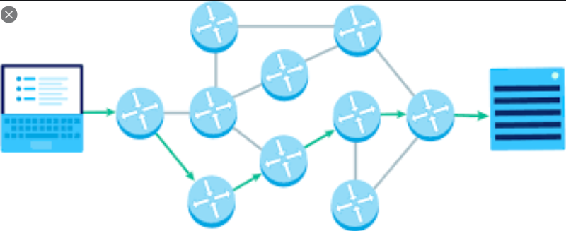

# ROUTING



# Cách đặt địa chỉ IP tĩnh

Để thay đổi địa chỉ IP tĩnh với Ubuntu từ bản 18.04 trở lên thực hiện như sau:

1. Truy cập vào file cấu hình `netplan` :

    ```bash
    cd /etc/netplan
    sudo nano 50-cloud-init.yaml
    ```

2. Thực hiện chỉnh sửa file với nội dung như sau

    ```bash
    ethernets:
     ens033:
      dhcp4: no
      addresses: [192.168.1.150/24]
      gateway4: 192.168.1.1
      nameservers:
       addresses: [8.8.8.8.8.8.4.4]
    ```

    Tại các mục bạn tự thay đổi thông số theo nhu cầu

3. Sau đó thực hiện kiểm tra lại file cấu hình thông qua lệnh:

    ```bash
    sudo netplan --debug apply
    ```

4. Kiểm tra lại việc chuyển sang sử dụng IP tĩnh

    ```bash
    ifconfig
    ```

    - Nếu thấy địa chỉ IP hiện tại của máy đã chuyển sang địa chỉ : 192.168.1.150 thì đã thành công !

# Cơ bản về Routing :


Định tuyến được chia thành 2 loại : Dynamic và Static Routing. Trong đó định tuyến động ( Dynamic ) được sử dụng nhiều hơn do tính linh hoạt của nó. Với 1 số trường hợp cụ thể thì người quản trị hệ thống sẽ setup định tuyến tĩnh để phục vụ nhu cầu cụ thể.

Trong hệ thống nếu có 2 loại định tuyến cùng hoạt động thì nó sẽ lựa chọn ưu tiên định tuyến tĩnh so với định tuyến động ( Do Static Route có AD lớn hơn AD của Dynamic Route )

Định tuyến tĩnh yêu cầu thiết lập thủ công và khi có thay đổi thì cần thay đổi các thông số thủ công

Trái ngược với đó, định tuyến động thực hiện chuyển tuyến đường đi 1 cách tự động, chọn đường đi ngắn nhất dựa vào các thuật toán, thể hiện khả năng linh hoạt khi chuyển phiên bản làm việc sang đường truyền có tốc độ cao hơn,...

Định tuyến động hoạt động trên nguyên lý chia sẻ bảng định tuyến, duy trì bảng này, cập nhật bảng này khi có thay đổi ( việc trao đổi thông tin như thế nào tùy vào phương thức định tuyến đang sử dụng ) 

# Cách cấu hình Static Route

Việc cấu hình static route được thực hiện đơn giản qua các bước sau:

1. Truy cập vào file cấu hình `netplan` :

    ```bash
    cd /etc/netplan
    sudo nano 50-cloud-init.yaml
    ```

2. Chính sửa file cấu hình, file cấu hình có dạng như sau :

    ```bash
    ...
    network:
        ethernets:
            enp0s3:
                dhcp4: false
                addresses: [192.168.1.202/24]
                gateway4: 192.168.1.1
                nameservers:
                  addresses: [8.8.8.8,8.8.4.4,192.168.1.1]
                  routes:
                  - to: 192.168.10.20/24
                    via : 192.168.10.125

    ```

    Trong đó 192.168.10.125 là interface để chuyển tiếp.

[SWITCH](ROUTING/SWITCH.md)