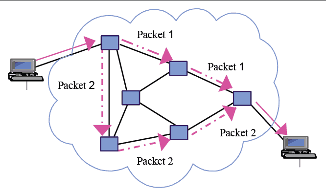

# SWITCH



Ở đây chúng ta sẽ sẽ tìm hiểu cơ bản về VLAN , các cách kết nối các VLAN với nhau và sẽ tìm hiểu thêm về kĩ thuật Etherchanel, Bonding

## 1. VLAN


Để tìm hiểu về VLAN chúng ta sẽ cùng tìm hiểu qua các câu hỏi cơ bản :

- Vậy VLAN là gì ? Nó chính là viết tắt cả Virtual Local Area Network tức là 1 mạng nội bộ ảo.
- Tại sao chúng ta cần VLAN ? VLAN giúp chúng ta tận dụng được băng thông ( do giảm Broadcast Domain ) và việc quản lý cũng trở nên dễ dàng hơn, tiết kệm chi phí hơn, ...
- Các trường hợp sử dụng VLAN ? Khi hệ thống quản lý đang được mở rộng và có số lượng máy lớn, yêu cầu đảm bảo bảo mật giữa các khu vực phòng ban khác nhau, ...

→ Chúng ta có cái nhìn cơ bản về VLAN, tiếp theo chúng ta sẽ đi tìm hiểu các loại VLAN thường thấy. VLAN được chia làm 5 loại chính và có 3 kiểu VLAN khác nhau

### 1.1 Các loại VLAN

- Data VLAN : Loại VLAN phổ biến nhất, được sử dụng để truyền tải dữ liệu
- Default VLAN : Loại VLAN đã có mặc định trên máy, có số hiệu 1 ( VLAN 1 ), không thể xóa VLAN này
- Native LAN : Là loại VLAN khi đi qua đường nối giữa các VLAN ( trunk ) thì không cần gắn số hiệu ID
- VLAN quản lý : VLAN này cần cấu hình thủ công cho địa chỉ IP, có tác dụng kết nối tới VLAN để quản lý, bảo trì, sửa chữa khi cần
- VLAN voice : VLAN thời gian thực, có độ ưu tiên cao nhất

### 1.2 Các kiểu VLAN

- Static VLAN : Admin cần cấu hình cho từng cổng Switch, máy tính kết nối với cổng Switch nào thì sẽ kết nối vào VLAN được cấu hình trên cổng đó
- Dynamic VLAN : VLAN được cấu hình theo địa chỉ MAC. Máy tính dù cắm vào cổng nào cúa Switch thì vẫn sẽ coi nó là 1 phần của VLAN được cấu hình sẵn
- Voice VLAN : dành riêng cho dữ liệu voice

*Một đặc điểm cơ bản của VLAN đó chính là việc các máy tính với cấu hình măc định  thuộc các VLAN không thể giao tiếp dữ liệu với nhau. Vậy thì làm thế nào để chúng ta có thể thực hiện điều này?*

### 1.3 VLAN trunking


Đây là công nghệ truyền tải dữ liệu giữa 2 Switch, được chia làm 2 loại, đó chính là :

1. Access mode : Cho phép các frame thông thường đi qua
2. Trunking mode : Cho phép nhiều miền VLAN đi qua ( kích thước ~ 100 Mbps )

Trong đó Trunking có 2 chuẩn hiện nay đang được sử dụng là 802.1Q và ISL 

## 2. Kỹ thuật Bonding


Về mặt ý tưởng cốt lõi ( Core Concept ) thì đây là loại kĩ thuật kết hợp 2 hoặc nhiều các giao diện mạng với nhau 

→ Tăng lượng băng thông khả dụng, đảm bảo khả năng chịu lỗi cao ( fault tolerance ),...

→ Tuy nhiên không đồng nghĩa với việc nó sẽ tăng tốc độ do ISP( Internet Service Provider ) cung cấp

Các loại bonding hiện tại :

- **mode=0** (balance-rr)
- **mode=1** (active-backup)
- **mode=2** (balance-xor)
- **mode=3** (broadcast)
- **mode=4** (802.3ad)
- **mode=5** (balance-tlb)
- **mode=6** (balance-alb)

Kĩ thuật này có thể áp dụng trên nhiều các OS khác nhau, nhưng ở đây chúng ta sẽ xét ví dụ trên Ubuntu với mode 0 :

1. Tiến hành cài pakage `ifenslave` :

    ```bash
    sudo apt-get install ifenslave
    ```

2. Thực hiện Bonding :

    Có thể thực hiện theo 2 cách

    1. Thay đổi tạm thời ( mất tác dụng khi reboot )

        ```bash
        $ sudo ip link add bond0 type bond mode 802.3ad
        $ sudo ip link set eth0 master bond0
        $ sudo ip link set eth1 master bond0
        ```

    2. Thay đổi vĩnh viễn 

        ```bash
        $ sudo nano /etc/network/interfaces
        ```

        ```bash
        # The primary network interface
        auto bond0
        iface bond0 inet static
        	address xxxxxxxxxxx
        	netmask xxxxxxxxxxx	
        	gateway xxxxxxxxxxx
        	dns-nameservers xxxxxxxxxx
        		slaves eth0 eth1
        		bond_mode 0
        		bond-miimon 100
        		bond_downdelay 100
        		bound_updelay 100
        ```

    3. Thực hiện restart dịch vụ mạng

        ```bash
        $ sudo systemctl restart networking.service
        ```

    4. Kiểm tra lại qua 

        ```bash
        ip a
        # hoac thong qua 
        ifconfig
        ```

        Kết quả có dạng :

        

    *Quá trình bonding 2 giao diện mạng đã thành công !*

    ---

    ## Nguồn tham khảo

    [How to Configure Network Bonding or Teaming in Ubuntu](https://www.tecmint.com/configure-network-bonding-teaming-in-ubuntu/)

    [Ubuntu setup a bonding device and enslave two real Ethernet devices - nixCraft](https://www.cyberciti.biz/faq/ubuntu-setup-a-bonding-device-and-enslave-two-real-ethernet-devices/)

    [4 Simple Steps to Setup Ethernet Bonding in Linux](https://linoxide.com/how-tos/ethernet-bonding-on-redhat-linux/)

    [Giới thiệu về VLAN - Đại học Không Giấy](https://www.daihockhonggiay.com/blogs/post/gioi-thieu-ve-vlan)

    [Virtual LAN](https://vi.wikipedia.org/wiki/Virtual_LAN)

    [VLAN là gì? 2 loại VLAN cơ bản nên biết!!! - TOTOLINK Việt Nam](https://www.totolink.vn/article/35-vlan-la-gi.html)

    [VLAN là gì? Làm thế nào để cấu hình một VLAN trên Switch?](https://quantrimang.com/vlan-la-gi-lam-the-nao-de-cau-hinh-mot-vlan-tren-switch-cisco-64830)

    [TỔNG QUAN VỀ VLAN - CẤU HÌNH VLAN CƠ BẢN -](https://vnpro.vn/thu-vien/tong-quan-ve-vlan-cau-hinh-vlan-co-ban-3106.html)

    [Có những loại VLAN nào? -](https://vnpro.vn/thu-vien/co-nhung-loai-vlan-nao-2124.html)

    [Routing VLAN](https://hocmangcoban.blogspot.com/2014/04/routing-vlan.html)

    [Làm thế nào để cấu hình Inter VLAN Routing](http://dotnet.edu.vn/ChuyenMuc/Lam-the-nao-de-cau-hinh-Inter-VLAN-Routing-204.aspx)