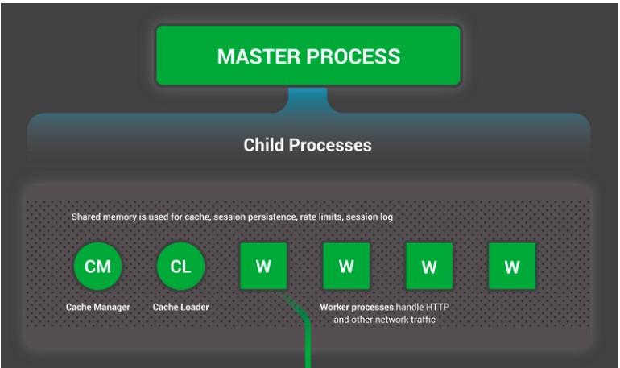

# NGINX

## 1. Nginx là gì ?

- NGINX ( đọc là "engine -x " ) là phần mềm mã nguồn mở được viết bởi Igor Sysoev sử dụng ngôn ngữ C và được  sử dụng để phục vụ web HTTP/HTTPS, cân bằng tải ( Load Balancer ) và sử dụng để làm Reverse Proxy.
- NGINX khác vói Apache, nó là 1 hệ thống không đồng bộ, phục vụ các yêu cầu tĩnh ( html,css,js,... ) với tốc độ nhanh và chuyển các yêu cầu phức tạp cho các Module phù hợp để xử lý → tăng tốc độ xử lý lên cao, sử dụng tài nguyên ở mức tối thiểu
- NGINX được thử nghiệm trong điều kiện xử lý 1000 tải 1 lúc mà vẫn đáp ứng được các điều kiện khác nhau
- Một vài trong số những ông lớn công nghệ dùng nó là Google, Netflix, Adobe, Cloudflare, WordPress và còn nhiều hơn nữa. Theo W3techs, Nginx được nhiều người sử dụng làm Web server chiếm tỉ lệ 42,1% tổng số lượng Web server trên thế giới.

    

    ---

## 2. So sánh NGINX với Apache

### Hiệu năng

1. Static content :

    

    - Ở nội dung tĩnh với 1000 kết nối cùng lúc thì NGINX có tốc dộ nhanh gấp 2.5 lần Apache
    - Còn với 512 kết nối thì NGINX nhanh hơn Apache gấp 2 lần
2. Dynamic content : 
    - Ở mục này thì NGINX và Apache có hiệu suất tương đương không quá khác biệt. Nguyên nhân là vì thời gian xử lý request chủ yếu là ở môi trường PHP thay vì phần cốt lõi của web server. Còn thời gian chạy trên môi trường PHP cho ra kết quả không mấy khác biệt.
    - Apache xử lý các Dynamic content trực tiếp trên web server mà không phụ thuộc quá nhiều vào các module hỗ trợ khác nhau
    - Ở mặt đối lập, NGINX không trực tiếp xử lí các Dynamic content mà chuyển cho các module phù hợp để xử lý và chuyển kết quả nhận được về phía clients

        

### Hệ điều hành hỗ trợ

- Apache hỗ trợ nhiều loại hệ điều hành khác nhau từ Unix-like OS đến các hệ điều hành như Microsoft Window.
- NGINX cũng hỗ trợ các hệ điều hành khác nhưng không mạnh mẽ bằng các hệ điều hành có lõi kernel.

    

### Bảo mật

- Apache và NGINX đều cung cấp các phương thức bảo mật cho server của người dùng
- Ngoài ra NGINX còn cung cấp thêm phiên bản NGINX-PLUS cho phép có thêm nhiều tiện ích khác nhau ( media streaming, giám sát,... )
- Apache cung cấp các hướng dẫn cấu hình chống DDoS, HTTP/HTTPS DDoS, Brute force attack ,...
- NGINX cũng cung cấp các topic bảo mật khác nhau trên trang chủ của mình tại [https://docs.nginx.com/](https://docs.nginx.com/)

### Tài liệu hỗ trợ


- NGINX và Apache cung cấp một lượng tài liệu sử dụng lớn, chi tiết và đẹp mắt cho nguời sử dụng .( NGINX hướng dẫn sử dụng cho cả 2 phiên bản NGINX và NGINX - PLUS)
- Ngoài ra NGINX còn có các khóa đào tạo, chứng chỉ riêng.

### Lưu ý

- Tuy hoạt động khác biệt nhau nhưng NGINX và Apache hoàn toàn có thể đặt trong cùng 1 hệ thống, tận dụng các điểm mạnh của mỗi hệ thống để đảm bảo server hoạt động ở 100% khả năng, mô hình hệ thống :

    

---

## 3. Hoạt động của  Web Server NGINX

- Khi nhận được yêu cầu của phía clients các yêu cầu sẽ được chuyển tới các Worker Process để thực hiện. Sau khi hoàn thành yêu cầu thì các Worker Process sẽ chuyển kết quả tới Master Process. Mỗi Worker Process có thể thực hiện 1024 yêu cầu giống nhau ( việc này còn tùy thuộc vào server ) → NGINX có thể hoạt động dưới điều kiện nhận được lượng request lớn

    

---

## 4. Tiến hành cài đặt NGINX trên Ubuntu 18.04 :

- NGINX hỗ trợ nhiều hệ điều hành khác nhau tuy nhiên ở cụ thể bài viết này sẽ tiến hành cài đặt trên hệ điều hành Ubuntu 18.04:

    ### *Bước 1 : Cài đặt NGINX*

    - NGINX có thể cài đặt thông qua hệ thống `apt package` của Ubuntu, thực hiện cài đặt thông qua:

    ```bash
    sudo apt update
    sudo install nginx
    ```

    Sau đó hệ thống sẽ tự động cài đặt NGINX

    ### *Bước 2 : Thay đổi cài đặt tường lửa*

    - Thông thường sau khi cài đặt NGINX sẽ tiến hành cấu hình nó như 1 service của tưởng lửa `ufw` ( tường lửa mặc định của Ubuntu) và sẽ được `ufw` thông qua các truy cập.
    - Liệt kê các ứng dụng mà `ufw` đã biết :

        `sudo ufw app list` 

         Kết quả nhận được sẽ có dạng như sau:

        ```bash
        Available applications:
          Apache
          Apache Full
          Apache Secure
          CUPS
          Nginx Full
          Nginx HTTP
          Nginx HTTPS
        ```

        Ở đây có 3 profile của NGINX:

        1. Nginx Full: Profile này mở cả 2 port 80 và port 443
        2. Nginx HTTP: Profile này sử dụng port 80 
        3. Nginx HTTPS: Profile này sử dụng port 443

    ### *Bước 3: Kiểm tra trạng thái của Nginx*

    - Sau khi tiến hành và hoàn tất quá trình cài đặt Nginx, Ubuntu mặc định sẽ chạy Service Nginx, tuy nhiên để xác nhận 1 lần nữa chúng ta có thể làm như sau

        ```bash
        systemctl status nginx
        ```

        Systemctl sẽ trả về 1 thông báo như sau :

        ```bash
        nginx.service - A high performance web server and a reverse proxy server
             Loaded: loaded (/lib/systemd/system/nginx.service; enabled; vendor preset: enabled)
             Active: active (running) since Fri 2020-08-21 15:45:54 +07; 6min ago
               Docs: man:nginx(8)
            Process: 856 ExecStartPre=/usr/sbin/nginx -t -q -g daemon on; master_process on; (code=exited, status=0/SUCCESS)
            Process: 1015 ExecStart=/usr/sbin/nginx -g daemon on; master_process on; (code=exited, status=0/SUCCESS)
           Main PID: 1019 (nginx)
              Tasks: 2 (limit: 2285)
             Memory: 5.8M
             CGroup: /system.slice/nginx.service
                     ├─1019 nginx: master process /usr/sbin/nginx -g daemon on; master_process on;
                     └─1020 nginx: worker process

        ```

    - Nếu Service Nginx đã ở trạng thái Active, người sử dụng có thể truy cập vào trình duyệt web nhập vào địa chỉ: `http://your_server_ip`

        Kết quả nhận được nếu Nginx không gặp lỗi trong quá trình cài đặt sẽ được trả về trang default index của Nginx :

        

    Như vậy quá trình cài đặt Nginx đã thành công !

    ---

## 5. Quản lí tiến trình Nginx:

- Việc quản lí tiến trình Nginx khá đơn giản, bao gồm các lựa chọn như sau
    1. Dừng tiến trình Nginx

        `sudo systemctl stop nginx` 

    2. Chạy tiến trình Nginx ( nếu trước đó đã thực hiện dừng )

        `sudo systemctl start nginx`

    3. Dừng tiến trình và sau đó bật lại ( Restart )

        `sudo systemctl restart nginx`

    4. Thông thường sau khi tiến hành chỉnh sửa config của Nginx chúng ta sẽ phải thực hiện tải lại cấu hình ( Reload Config ) của Nginx, việc này được thực hiện thông qua:

        `sudo systemctl reload nginx`

    5. Với cấu hình mặc định thì Nginx sẽ tự động bật lên khi hệ thống được khởi động, nếu người dùng không muốn khởi động Nginx ngay khi hệ thống được bật lên có thể thông qua lệnh sau: 

        `sudo systemctl disable nginx`

        Để tiến hành khởi động Nginx cùng hệ thống:

        `sudo systemctl enable nginx`

---

## 6. Các đường dẫn của Nginx :

Sau khi đã làm quen với các thao tác quản lí Nginx, chúng ta sẽ làm quen với các đường dẫn của Nginx ( nơi lưu file config, file cấu hình web ,.... ) :

### Server Configuration

1. `/etc/nginx` : Nơi lưu các file cấu hình của Nginx , các file cấu hình liên quan khác cũng được lưu trữ ở đây
2. `/etc/nginx/nginx.con` : File config chính của Nginx, việc thực hiện set up server hay điều chỉnh các tham số kĩ thuật được thực hiện tại đây
3. `/etc/nginx/sites-available/` : Nơi các cấu hình của các website khác nhau được lưu. Nginx sẽ không sử dụng các tệp cấu hình được tìm thấy trong thư mục này trừ khi chúng được liên kết với thư mục `sites-enabled`
4. `/etc/nginx/sites-enabled/` :  Thư mục lưu trữ các khối máy chủ cho mỗi trang web. Thông thường, chúng được tạo bằng cách liên kết đến các tệp cấu hình được tìm thấy trong `sites-available`

### Server Logs

1. `/var/log/nginx/access.log` :  File log lưu trữ mọi truy cập vào server Nginx 
2. `/var/log/nginx/error.log` : File log lưu trữ các lỗi của Nginx
### Nguồn tài liệu tham khảo

[https://docs.nginx.com](https://docs.nginx.com/)

[https://www.hostinger.vn/huong-dan/nginx-la-gi-no-hoat-dong-nhu-the-nao/](https://www.hostinger.vn/huong-dan/nginx-la-gi-no-hoat-dong-nhu-the-nao/)

[https://serverguy.com/comparison/apache-vs-nginx/#4](https://serverguy.com/comparison/apache-vs-nginx/#4)
