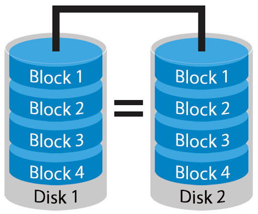

# RAID

- RAID là gì ? Được sử dụng để làm gì ?
    - RAID viết tắt cho Redundant Array of Independable Disk
    - Có chức năng ghép nhiều ổ đĩa cứng thành 1 hệ thống giúp cho:
        1. Gia tăng tốc độ đọc ghi
        2. Củng cố sự an toàn của hệ thống dữ liệu
- Các loại RAID phổ biến là gì ?
    - Có vô số các loại RAID khác nhau như: RAID 0, RAID 1, RAID 2, RAID 3, RAID 4,etc

    → nhưng 4 loại phổ biến nhất thuộc về các loại 0, 1, 5, 10

    Và ở đây ta sẽ tìm hiểu về 4 loại RAID nói trên

- Trình bày về RAID 0 ?

    

    - Nguyên lý: Đơn giản, cần tối thiểu 2 disk, khi ghi dữ liệu sẽ chia đôi dữ liệu ra 2 ổ( có thể nhiều hơn tùy vào số lượng ổ sử dụng RAID 0 ) → gia tăng tốc độ đọc ghi theo lý thuyết
    - Ưu điểm 👍: Gia tăng được tốc độ đọc ghi nhanh
    - Nhược điểm 👎: theo cơ chế " high risk high reward " . Tiểm ẩn khả năng mất dữ liệu cao

- Trình bày về RAID 1 ?

    

    - Nguyên lí: đơn giản, dựa trên quy tắc mirroring ( 2 ổ cứng gần như y hệt nhau ) → so với RAID 0 cung cấp được sự an toàn về dữ liệu hơn
    - Ưu điểm 👍: An toàn, đơn giản
    - Nhược điểm 👎: Đòi hỏi chi phí cao, hiệu năng chưa tối ưu ( Do dung lượng thức sự dùng được chỉ được 0.5 dung lượng tổng )
- Trình bày về RAID 5 ?

    

    - Nguyên lý : Yêu cầu tối thiểu 3 disk. Khi lưu file sẽ đc chia nhỏ thành các phân lưu trữ tại các ổ khác nhau. 1 ổ cứng sẽ lưu backup của các phần này.
    - Ưu điểm 👍: Chi phí rẻ hơn RAID 10, hiệu suất cao, tốc độ nhanh
    - Nhược điểm 👎: Chi phí phát sinh ( do có 1 ổ backup )
- Trình bày về RAID 10 ?

    

    - Nguyên lý: là sự kết hợp của RAID 1 và RAID 0. Yêu cầu 4 ổ cứng. Khi dữ liệu được ghi thì sẽ đc ghi ra 4 ổ với 2 ổ sử dụng Striping( RAID 0)  và 2 ổ sử dụng Mirroring (RAID 1)
    - Ưu điểm 👍: Tốc độ nhanh, an toàn, hiệu suất cao
    - Nhược điểm : Chi phí cao

- Tài liệu tham khảo

    [https://secure.vinahost.vn/ac/knowledgebase/252/Tm-hiu-chung-v-cc-loi-RAID-lu-tr.html](https://secure.vinahost.vn/ac/knowledgebase/252/Tm-hiu-chung-v-cc-loi-RAID-lu-tr.html)
