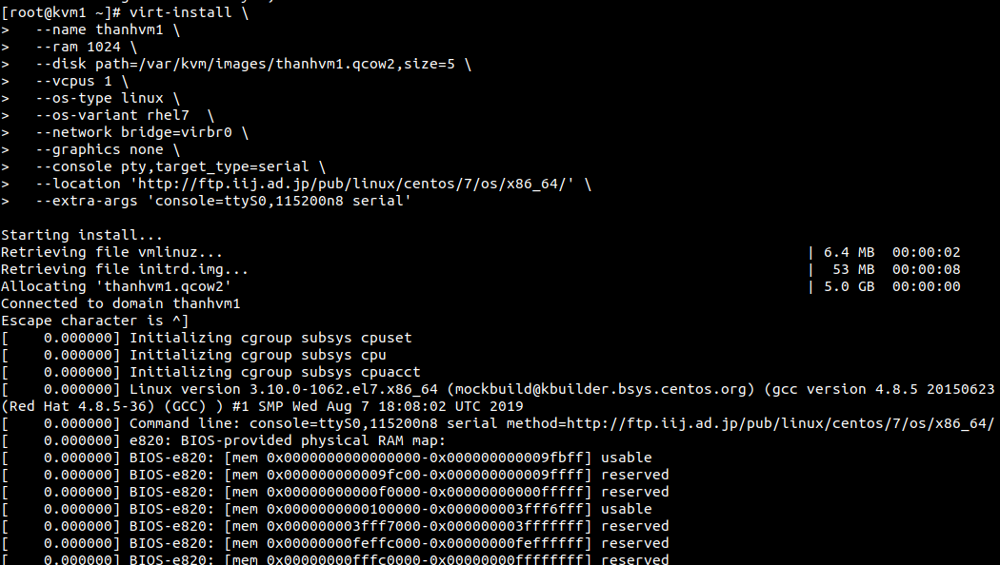

#  Cài đặt máy ảo với KVM trên Centos7.
### 1. KVM là gì.
KVM là công nghệ ảo hóa mới cho phép ảo hóa thực sự trên nền tảng phần cứng. Do đó máy chủ KVM được cung cấp riêng tài nguyên để sử dụng, tránh việc tranh chấp tài nguyên với máy chủ khác trên cùng node. Máy chủ gốc được cài đặt Linux, nhưng KVM hỗ trợ tạo máy chủ ảo có thể chạy cả Linux, Windows. Nó cũng hỗ trợ cả x86 và x86-64 system. Đòi hỏi CPU trên máy tính của bạn có chức năng Intel VT hoặc AMD-V.

### 2. Cài đặt KVM trên centos7.

Tải một sô packet và thư viện cần thiết.
```
yum install qemu-kvm libvirt virt-install bridge-utils virt-manager virt-viewer -y
```
Đối với bản Minimal để dùng được công cụ đồ họa virt-manager người dùng phải cài đặt gói x-window bằng câu lệnh
```
yum install "@X Window System" xorg-x11-xauth xorg-x11-fonts-* xorg-x11-utils -y
```

Khởi động  dịch vụ libvirtd
```
systemctl start libvirtd
```

Khởi động  dịch vụ libvirtd cùng hê thống.
```
systemctl enable libvirtd
```

Sử dụng lệnh virt-install để tạo một máy ảo.
có rất nhiều cách tạo mấy ảo KVM trên đây t sử dụng cách tạo máy áo từ internet.
```
virt-install \
--name centos7 \
--ram 1024 \
--disk path=/var/lib/libvirt/images/centos7.img,size=10 \
--vcpus 1 \
--os-type linux \
--os-variant rhel7 \
--network bridge=virbr0 \
--graphics none \
--console pty,target_type=serial \
--location 'http://ftp.iij.ad.jp/pub/linux/centos/7/os/x86_64/' \
--extra-args 'console=ttyS0,115200n8 serial'
```



