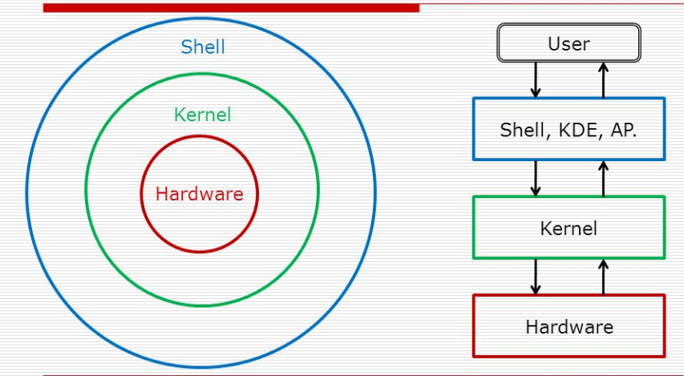

# Shell và phân loại.

## 1. Shell là gì?
Đầu tiên ta cần hiều shell là gì. Shell hiểu một cách đơn giản là 1 chương trình nhận và phiên dịch các câu lệnh (command-line) dưới dạng text, nó là interface để ta tương tác với hệ thống



Các bạn có thể nghe nhiều đến từ "nhân Linux", "nhân hệ điều hành", nhân hay kernel có nhiệm vụ là giao tiếp với hardware. Và nhân thì thường đi kèm với vỏ. Vỏ ở đây tức là shell, shell có nhiệm vụ là cầu nối giao tiếp giữa user và kernel. Do người dùng và máy tính không cùng chung ngôn ngữ nên cần có 1 người thông dịch, shell chính là người làm việc đó, shell là 1 intepreter, thông dịch command từ input của user, chuyển đến kernel, và lấy ouput trả về hiển thị cho người dùng.

Có nhiều loại shell trong Linux nhưng thông dụng nhất có thể kể đến đó là bash, zsh, fish, sh...

Shell có hai kiểu:

- Default interactive shell:

    - User nhập lệnh và chạy chương trình trên shell này.

- Default system shell:

    - Được Linux sử dụng để chạy các script, thường khi khởi động máy.

## 2. Có những loại lệnh nào ?

Trong Linux có thể kể đến các loại lệnh sau:

- `Executable program` hay binary. Những lệnh này thường là những chương trình được viết bằng C or C++ hay Go... và được biên dịch thành file executable (file nhị phân - mã máy nên có thể thực thi trực tiếp, các bạn có thể quen thuộc với các file có đuôi .exe trên Windows, nhưng trên Linux thường thì không có đuôi cụ thể nào), hoặc là những script được viết bằng Bash, Ruby, Python, PHP...
- Loại thứ hai gọi là `shell builtin`. Builtin commands là những lệnh do shell cung cấp. Ví dụ lệnh thường dùng pwd, cd là những shell builtin, giống như những cú pháp, function mà 1 ngôn ngữ lập trình cung cấp.
- Loại thứ 3 đó là `shell function`. Nó giống như những function thông thường trong lập trình, nhưng những function này là của shell do đó nó có thể thực thi được.
- Loại cuối cùng là `alias`, loại này được tạo thành từ những lệnh có sẵn khác bằng cách nhóm lại hoặc với 1 số tham số cố định. Chẳng hạn, khi dùng git chúng ta hay dùng lệnh git status, chúng ta có thể rút gọn lại bằng alias: gst="git status", sau đấy thay vì gõ git status chúng ta có thể gõ lệnh gst thay thế


## 3. Lệnh Type là  gì?
Lệnh Type được sử dụng để tìm hiểu thông tin về một lệnh Linux. Như tên của nó, bạn có thể dễ dàng tìm xem lệnh đã cho là alias, shell built-in, file, function. Ngoài ra, bạn cũng có thể tìm thấy đường dẫn thực tế của lệnh

### 3.1 Loại Executable program.
Là chương trình thực thi được việt bằng các ngôn ngữ lập trình như c, c++, golang, ... Các file này sẽ được dịch ra cac file nhị phân để máy tính có thể đọc được. Trên windows sẽ được dịch thành các file có đuôi là .exe. Trên linux các file thực thi được việt trên tập lệnh shell  và kết thúc bằng .sh và được thực thi thông qua bash shell.

Bất kỳ tệp lệnh nào bắt đầu bằng `!#`( được gọi là shebang hay hashbang) trên dòng lệnh đầu tiên là một tập lệnh thực thi.

Đường dẫn sau shebang là đường dẫn đến chương trình thực thi.

Ví dụ file thực thi
```
$ file script.sh
script.sh: Bourne-Again Shell script text
```

### 3.2 Loại shell builtin.
Builtin commands là những lệnh do shell cung cấp các lệnh này đã được lập trình sẵn trong hệ thông chỉ cần gọi nó ra không cần lập trình thêm. Ví dụ lệnh thường dùng pwd, cd là những shell builtin.

### 3.3 Loại shell function.


### 3.4 Loại alias trong Linux.
Bí danh (alias) về cơ bản là 1 đường tắt (shortcut) thay thế cho 1 câu lệnh dài trong Linux.

Alias trong Linux cũng có chức năng giống với Shortcut trong Windows. Nó giúp cho người dùng không phải nhớ và nhập các câu lệnh dài khi muốn chạy 1 chương trình.

Tạo một bí danh cú pháp chung sẽ như sau:
` alias new_comand='command sequence'`

Trong đó: 
- new_command là tên bí danh cần đặt
- command sequence là câu lệnh thực thi sau bí danh đó

Các lệnh bí danh chỉ là tạm thời nêu muốn dùng chúng lâu dài thì cần lưu vào 1 file thức thi cú pháp như sau:
`echo 'alias install="sudo yum install -y" ' >> ~/.bashrc`

Trong đó:
- *alias install="sudo yum install -y*  là câu lệnh thực thi
- *~/.bashrc* là nơi lưu câu lệnh.


Xóa 1 bí danh ta chỉ cần xóa dòng khai báo trong tập tin *~/.bashrc* là xong.