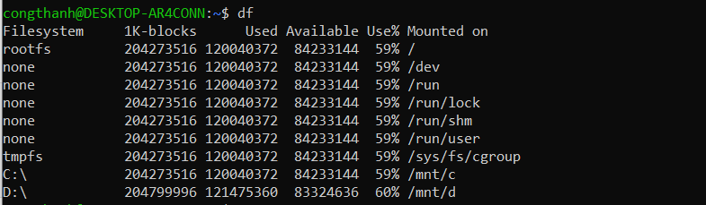
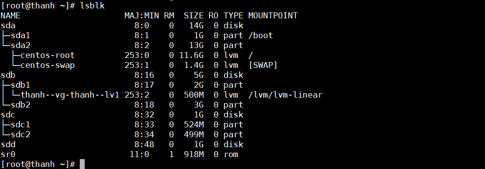
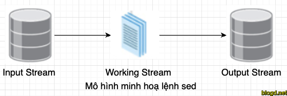

# Tìm hiểu các lệnh căn bản trong linux


## 1. Du (Disk usage)

du là một công cụ dòng lệnh được cung cấp với Linux, nhằm báo cáo dung lượng ổ đĩa được sử dụng bởi các thư mục và file. du là viết tắt của từ “disk usage”. Đây là công cụ chính để phân tích không gian ổ đĩa trong dòng lệnh.

Chạy lệnh du với một thư mục để xem phân tích đầy đủ về không gian ổ đĩa mà mỗi thư mục đang nắm giữ. Mỗi thư mục sẽ được liệt kê lần lượt trong đầu ra tiêu chuẩn, vì vậy các thư mục lớn hoặc việc quét toàn bộ hệ thống có thể tạo ra hàng chục ngàn dòng kết quả và mất lượng thời gian đáng kể. Kết quả là, lệnh du cơ bản thường được bổ sung với các flag (sẽ được chỉ ra bên dưới). Bất kỳ flag nào trong số này đều có thể kết hợp với một flag khác, mặc dù một số tổ hợp loại trừ lẫn nhau vì chúng trái ngược nhau.

Các option cơ bản của du:
```
du -s     (tổng dung lượng ổ đĩa được sử dụng)
du -h     (thay đổi việc hiển thị dung lượng)
du --threshold=SIZE  (Loại trừ các mục nhỏ hơn SIZE)
```

## 2. df (disk filesystem)
Lệnh “df” viết tắt của “disk filesystem“, nó được dùng để lấy toàn bộ thông tin về lượng ổ cứng khả dụng và lượng ổ cứng đã dùng của các file hệ thống trên linux.



Việc sử dụng “-h” trong lệnh “df -h” cho ta một cái nhìn trực quan hơn khi đọc các thông số ở chế độ chi tiết :bytes, mega bytes and giga bytes.

Sau đây là những lệnh “df” hay sử dụng khi quản trị hệ thống linux.

```
df -a        (Hiện thị thông tin  ổ đĩa các file hệ thống sử dụng)

df -h         (Hiển thị dung lượng đĩa sử dụng dạng MB và GB)

df -hT /home   (Hiện thị thông tin về thư mục Homes)

df -i          (Xem thông tin Inodes)
```

## 3. Lệnh lsblk

lsblk hiển thị thông tin về các thiết bị lưu trữ. Tiện ích này thường được sử dụng để xác định tên thiết bị chính xác được truyền cho lệnh tiếp theo.

Trong hầu hết mọi trường hợp, chỉ lsblk, không cần bất kỳ tham số bổ sung nào, cũng đủ để giúp xác định ổ đĩa hoặc phân vùng bạn muốn làm việc




## 4. Lệnh grep và egerp.
grep là từ viết tắt của "In biểu thức chính quy toàn cầu". grep là chương trình quét từng tệp hoặc tệp được chỉ định theo từng dòng, trả về các dòng có chứa mẫu. Mẫu là một biểu thức chỉ định một chuỗi các chuỗi bằng cách giải thích các ký tự là các ký tự meta. Ví dụ, ký tự dấu hoa thị (*) được hiểu là "không hoặc nhiều phần tử trước". Điều này cho phép người dùng nhập một loạt ký tự ngắn và ký tự meta vào lệnh grep để máy tính hiển thị cho chúng tôi dòng nào khớp với tệp.

Các option thông dụng, bạn có thể gặp và sử dụng:

- -f : thay vì việc bạn chỉ ra một partern dài, bạn có thể chỉ ra file chứa partern đó
- -i : bỏ qua mọi khác biệt về chữ hoa/thường giữa partern và nội dung trong file đầu vào
- -v : thực hiện tìm các dòng không chứa partern được đưa ra
- -w : chỉ tìm những dòng mà có từ khớp toàn bộ với mẫu tìm kiếm
- -x : tìm dòng mà toàn bộ dòng khớp với mẫu tìm kiếm
- -c (–count ): Thay vì liệt kê các dòng khớp, nó cho ra số dòng khớp, nếu sử dụng cùng với tùy chọn -v thì nó sẽ đếm số dòng không khớp
- -m NUM hoặc –max-count=NUM : Khi khớp được NUM dòng, nó sẽ không tìm tiếp trong file nữa
- -q hoặc –quiet, –silent : Không in ra bất cứ thứ gì ở standard output, trả về 0 khi match được bất cứ môt kết quả nào. Khi bạn chạy một shell thì điều này sẽ cần dùng đến. Nếu không thu được kết quả nào, sẽ trả về một lỗi error (có thể sẽ được gửi tới stder :D).
- -H hoặc –with-filename : in các dòng match cùng với tên file chứa nó (trong trường hợp tìm trên nhiều file). Tùy chọn này là mặc định, bạn không cần chỉ ra nó.
- -h, hoặc –no-filename : không thêm tên các file ứng với các dòng match.


egrep là từ viết tắt của "In biểu thức chính quy toàn cầu mở rộng".

'E' trong egrep có nghĩa là coi mẫu như một biểu thức chính quy. "Biểu thức chính quy mở rộng" viết tắt 'ERE' được bật trong egrep. egrep (mà cũng giống như grep -E) xử lý +, ?, |, (, và )như meta-ký tự.

Trong biểu thức thông thường cơ bản (với grep), meta-nhân vật ?, +, {, |, (, và )mất ý nghĩa đặc biệt của họ. Nếu bạn muốn grep để điều trị những nhân vật như meta-nhân vật, thoát khỏi chúng \?, \+, \{, \|, \(, và \).


## 5. Lệnh sed
Lệnh sed là công cụ xử lý văn bản mạnh mẽ và là một tiện ích UNIX lâu đời nhất và phổ biến nhất. Nó được sử dụng để sửa đổi nội dung của một tệp, thường đặt nội dung vào một tệp mới.

Lệnh sed có thể lọc văn bản, cũng như thực hiện thay thế trong luồng dữ liệu.

Dữ liệu từ một nguồn/tệp đầu vào được lấy và di chuyển đến không gian làm việc. Toàn bộ danh sách các hoạt động/sửa đổi được áp dụng trên dữ liệu trong không gian làm việc và nội dung cuối cùng được chuyển đến không gian đầu ra tiêu chuẩn.



sed có thể được dùng để thay thế những xuất hiện của 1 chuỗi với 1 chuỗi khác trong 1 văn bản.
```
$ sed 's/pattern/replace_string/' file
```

sed có thể được dùng để thay thế những xuất hiện của 1 chuỗi với 1 chuỗi khác trong 1 văn bản.
```
$ sed 's/pattern/replace_string/g' file
```

Ngoài việc phân cách băng `/` Chúng ta có thể sử dụng các ký tự phân cách bất kỳ như sau:
```
$ sed 's:text:replace:g'
$ sed 's|text|replace|g'
```


## 6. Lệnh awk

Ngôn ngữ awk là một ngôn ngữ lập trình giúp chúng ta thao tác dễ dàng với kiểu dữ liệu có cấu trúc và tạo ra những kết quả được định dạng. Nó được đặt tên bằng cách viết tắt các chữ cái đầu tiên của các tác giả: Aho, Weinberger và Kernighan.

Lệnh awk sử dụng để tìm kiếm và xử lý file text. Nó có thể tìm kiếm một hoặc nhiều file để xem các file có dòng nào bao gồm những pattern cần tìm kiếm và sau đó thực hiện những action. Cú pháp của lệnh awk như sau:
```
awk pattern actions file
```

Trong đó:

- pattern: là những biểu thức chính quy
- actions: là những câu lệnh cần thực hiện
- file: file cần thực hiện lệnh awk

Cách lệnh awk hoạt động:

- Lệnh awk đọc file đầu vào theo từng dòng.
- Đối với mỗi dòng, nó sẽ khớp lần lượt với các pattern, nếu khớp thì sẽ thực hiện action tương ứng. Nếu không có pattern nào được so khớp thì sẽ không có action nào thực hiện.
- Cú pháp cơ bản làm việc với lệnh awk thì pattern hoặc action phải có 1 trong 2 không thể thiếu cà 2.
- Nếu không có pattern, awk sẽ thực hiện action đối với mỗi dòng của dữ liệu. Nếu không có action, awk sẽ mặc định in ra tất cả những dòng khớp với pattern đã cho.
- Mỗi câu lệnh trong phần action được phân tách nhau bởi dấu chấm phẩy.


Ví dụ: lệnh awk sẽ in ra từng dòng của file. Cú pháp như sau:
```
awk '{print}' file.txt 
```