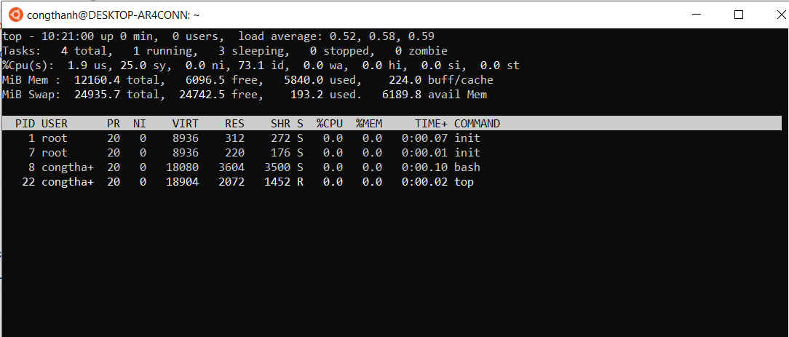
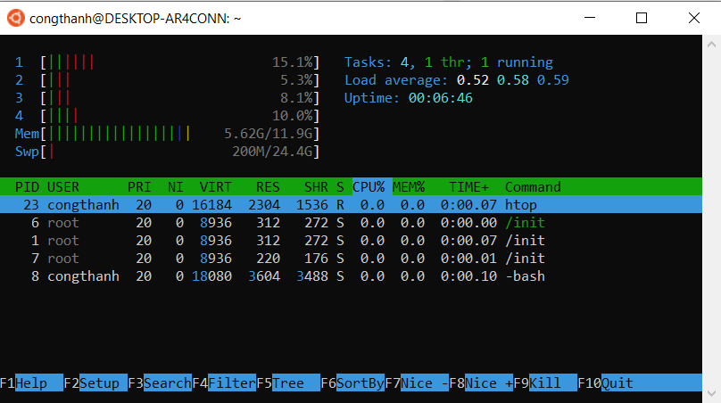
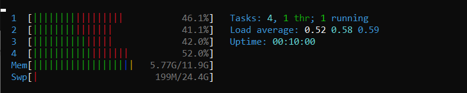
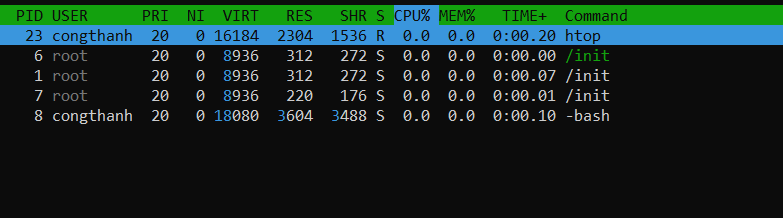
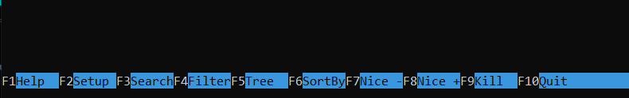
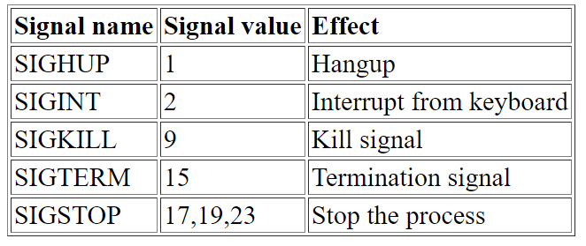

# Các công cụ quản lý cơ bản.

Mục lục 

[1. Lệnh top và htop](#1)

[2. Lệnh ps và lsof](#2)

[3. Lệnh kill](#3)

----


## <a name="1"> Lệnh Top và htop </a>

Lệnh top trong Linux được sử dụng để hiển thị tất cả các tiến trình đang chạy trong môi trường Linux. Hướng dẫn này chỉ cho bạn cách sử dụng lệnh top thông qua việc giải thích những tham số khác nhau có sẵn và nội dung mà chúng hiển thị

Để sử dụng `top` ta cần mở terminal lên và gõ `top` rồi ấn Enter.



Thông tin sau được hiển thị khi bạn chạy lệnh top trong Linux:

Dòng 1
Thời gian
- Máy tính đã chạy được bao lâu rồi
- Số lượng người dùng
- Trung bình tải
- Trung bình tải hiển thị thời gian load hệ thống trong 1, 5 và 15 phút cuối.

Dòng 2
- Tổng số nhiệm vụ
- Số lượng tác vụ đang chạy
- Số lượng tác vụ trong trạng thái “ngủ”
- Số lượng tác vụ đã dừng
- Số lượng tác vụ zombie (tiến trình không tồn tại)

Dòng 3
- Mức sử dụng CPU bởi người dùng theo tỷ lệ phần trăm
- Mức sử dụng CPU bởi hệ thống theo tỷ lệ phần trăm
- Mức sử dụng CPU bởi các tiến trình có mức ưu tiên thấp theo tỷ lệ phần trăm
- Mức sử dụng CPU bởi idle process (tiến trình cho biết bộ xử lý đang rảnh rỗi) theo tỷ lệ phần trăm
- Mức sử dụng CPU bởi io wait (thời gian CPU không hoạt động để chờ I/O disk hoàn thành) theo tỷ lệ phần trăm
- Mức sử dụng CPU bởi việc ngắt phần cứng theo tỷ lệ phần trăm
- Mức sử dụng CPU bởi việc ngắt phần mềm theo tỷ lệ phần trăm
- Mức sử dụng CPU bởi steal time (thời gian CPU ảo “chờ” CPU thực, trong khi bộ ảo hóa đang phục vụ bộ xử lý ảo khác) theo tỷ lệ phần trăm

Dòng 4
- Tổng bộ nhớ hệ thống
- Bộ nhớ trống
- Bộ nhớ đã sử dụng
- Bộ nhớ đệm buffer cache

Dòng 5
- Tổng swap có sẵn
- Tổng swap còn trống
- Tổng swap đã sử dụng
- Bộ nhớ khả dụng

Swap là RAM ảo, được sử dụng khi bộ nhớ vật lý (RAM) bị đầy.

Bảng chính
- ID tiến trình
- Người dùng
- Mức độ ưu tiên
- Mức độ nice (gọi một tập lệnh shell với mức độ ưu tiên cụ thể)
- Bộ nhớ ảo được sử dụng bởi tiến trình
- Bộ nhớ “thường trú” mà một tiến trình sử dụng (tức là tiến trình luôn ở trong bộ nhớ và không thể chuyển ra thiết bị lưu trữ khác)
- Bộ nhớ có thể chia sẻ
- CPU được sử dụng bởi tiến trình theo tỷ lệ phần trăm
- Bộ nhớ được sử dụng bởi tiến trình theo tỷ lệ phần trăm
- Thời gian tiến trình đã được chạy
- Lệnh

## Sử dụng Htop 



Htop chia làm 3 phần header, body và footer

Phần header hiển thị các số liệu hệ thống bao gồm CPU, Ram, Swap, các tác vụ đang chạy, load average và thời gian hoạt động (Uptime).



Phần này liệt kê tất cả các tiến trình đang chạy.


Phần này hiển thị các tùy chọn menu của htop


## <a name="2"> Lệnh ps và lsof </a>

Lệnh `ps` đươc sử dụng để hiển thị tất cả các tiến trình của máy tính.

Lệnh `ps` còn có thể kết hợp với một sô lệnh lọc và tìm kiếm khác.

Ví dụ:
```
ps -ef -p 1234,5678,9012 (lọc theo tiến trình)
ps -ef | grep worker    (lọc cùng với câu lệnh grep)
ps -e --sort=-pcpu -o pid,pcpu,comm   ( sắp xếp các tiến trình theo cách sử dụng)
ps -f -U root -u root    (hiện thị tất cả các tiến trình)
```


Lệnh lsof(list open files) là lệnh được sử dụng để liệt kê thông tin về các tệp được mở bởi các quy trình khác nhau. Trong hệ điều hành Linux, mọi thứ là một tập tin(ví dụ như: pipes, sockets, directories, devices,...). Lệnh lsof được phát triển và hỗ trợ bởi Victor A. Abell. Chương trình sẽ liệt kê những tệp đang mở và tiến trình nào đang sử dụng chúng.


## <a name="3"> Lệnh Kill và cách sử dụng signalkill </a>
Tác vụ (tasks) trong Linux được gọi là Processes (tiến trình). Mỗi process có ID Process duy nhất. Để xóa một tiến trình trong Linux, bạn sẽ dùng lệnh kill. Trong bài hướng dẫn này, chúng tôi sẽ chỉ bạn cách kill process Linux, để tăng cường kỹ năng sử dụng VPS của bạn.

Kill Command Linux có thể quản lý tiến trình trong Linux:

- Dừng bất kỳ process tự động nào
- Dừng một process được vô tình được kích hoạt
- Dừng một process chiếm nhiều bộ nhớ
- Buộc dừng bất kỳ process nào trong Linux
- Dừng một process chạy nền

Ngoài việc tắt process, lệnh kill còn có nhiều tính năng khác. Như gửi tín hiệu tới một process. Mặc định, tín hiệu TERM gửi đi sẽ tắt process.

Để kill một process ta có 2 cách:

- Cách 1 kill bằng PID ( Process IDentity)

    Cú pháp lệnh : `kill sigkill PID`

    

    Ví dụ: `kill -9 63772`

    Để biết PID của tiến trình ta sử dụng lệnh `ps`

- Cách 2 kill bằng tên tiến trình hoặc dịch vụ.

    Cú pháp: `pkill service name`

    Ví dụ: `pkill chrome`: Sau khi ta thực hiện câu lệnh này thì trình duyệt chrome sẽ bị đóng.


