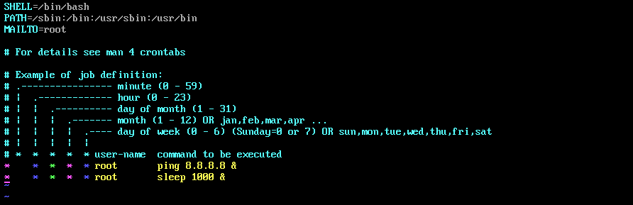
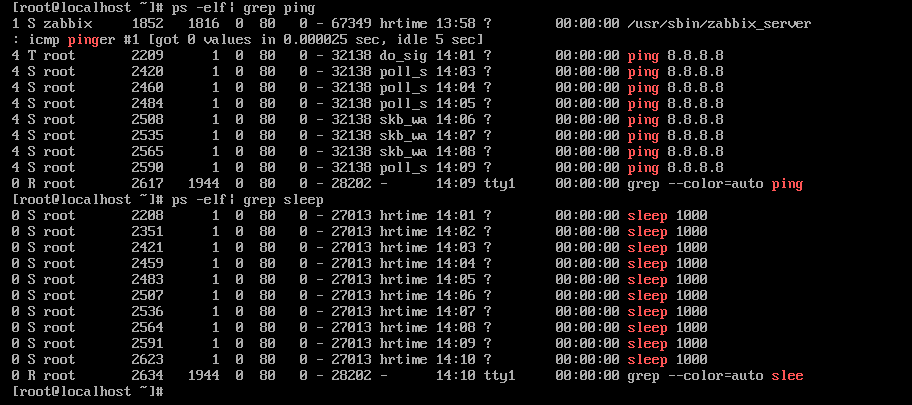
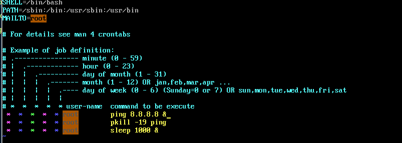
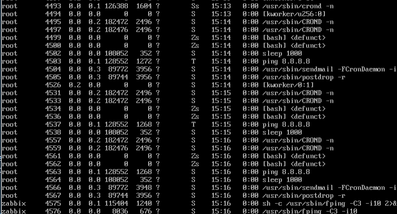
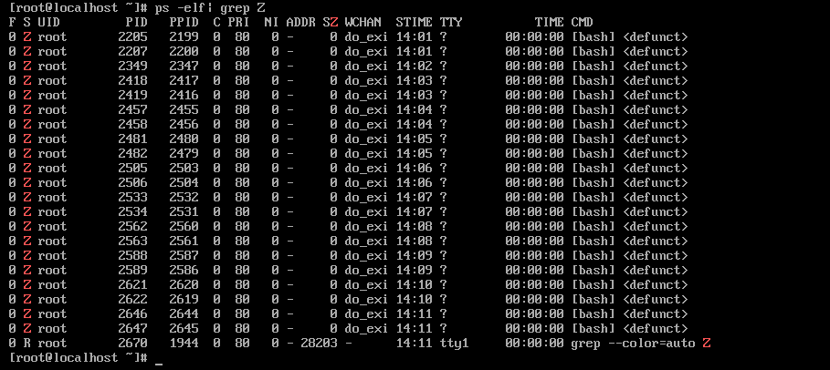

# Tìm hiểu Cron, Cronjob và crontab.

# Mục mục 

[1 . Cron là gì ?](#1)

[2. Cronjob và Crontab](#2)


---


# 1. Tìm hiểu về cron trong linux.

Cron là một daemon lập lịch trình thực thi các tác vụ theo các khoảng thời gian xác định. Các tác vụ này được gọi là cron jobs và chủ yếu được sử dụng để tự động hóa việc bảo trì hoặc quản trị hệ thống.

Ví dụ: Có thể đặt cron job để tự động hóa các tác vụ lặp đi lặp lại như sao lưu cơ sở dữ liệu hoặc dữ liệu, cập nhật hệ thống với các bản vá bảo mật mới nhất, kiểm tra việc sử dụng dung lượng đĩa, gửi email, v.v.

Các công việc cron có thể được lên lịch chạy theo phút, giờ, ngày trong tháng, tháng, ngày trong tuần hoặc bất kỳ sự kết hợp nào của chúng.


# 2. Cronjob và Crontab.

Crontab  là một tệp văn bản chỉ định lịch trình của các công việc cronjobs. Có hai loại tệp crontab. 
- Các tệp crontab trên toàn hệ thống.
- Các tệp crontab của người dùng cá nhân.

Tệp crontab của người dùng được đặt tên theo tên của người dùng và vị trí của chúng khác nhau tùy theo hệ điều hành. Trong các bản phân phối dựa trên Red Hat như CentOS, các tệp crontab được lưu trữ trong thư mục `/var/spool/cron`, trong khi trên Debian và Ubuntu các tệp được lưu trữ trong thư mục `/var/spool/cron/crontabs`.

Mặc dù bạn có thể chỉnh sửa các tệp crontab của người dùng theo cách thủ công, nhưng bạn nên sử dụng lệnh crontab.

Tệp `/etc/crontab` và các tập lệnh bên trong thư mục `/etc/cron.d` là các tệp crontab trên toàn hệ thống mà chỉ quản trị viên hệ thống mới có thể chỉnh sửa được.

Trong hầu hết các bản phân phối Linux, bạn cũng có thể đặt các tập lệnh bên trong thư mục `/etc/cron.{hourly,daily,weekly,monthly}` và các tập lệnh sẽ được thực thi hàng giờ/ngày/tuần/tháng.


Cú pháp của một cronjobs
```
* * * * * command(s)
- - - - -
| | | | |
| | | | ----- Day of week (0 - 7) (Sunday=0 or 7)
| | | ------- Month (1 - 12)
| | --------- Day of month (1 - 31)
| ----------- Hour (0 - 23)
------------- Minute (0 - 59)
```
Cú pháp của các lệnh trong file crontab trên toàn hệ thống hơi khác so với crontab của người dùng. Nó chứa một trường người dùng bắt buộc bổ sung chỉ định người dùng nào sẽ chạy công việc cron.
```
* * * * * <username> command(s)
- - - - -  -
| | | | |  |
| | | | |  -- User thực hiện cronjobs
| | | | ----- Day of week (0 - 7) (Sunday=0 or 7)
| | | ------- Month (1 - 12)
| | --------- Day of month (1 - 31)
| ----------- Hour (0 - 23)
------------- Minute (0 - 59)
```
Crontab Restrictions
Các tệp /etc/cron.deny và /etc/cron.allow cho phép kiểm soát người dùng nào có quyền truy cập vào crontab. Các tệp bao gồm một danh sách tên người dùng, một tên người dùng trên mỗi dòng.
Theo mặc định, chỉ có tệp /etc/cron.deny tồn tại và trống, có nghĩa là tất cả người dùng đều có thể sử dụng lệnh crontab. Nếu bạn muốn từ chối quyền truy cập vào các lệnh crontab cho một người dùng cụ thể, hãy thêm tên người dùng vào tệp này.

Nếu tệp /etc/cron.allow tồn tại thì chỉ những người dùng được liệt kê trong tệp này mới có thể sử dụng lệnh crontab.

Nếu cả hai tệp đều không tồn tại, chỉ những người dùng có đặc quyền quản trị mới có thể sử dụng lệnh crontab

Demo cấu hình crontab.


Ý nghĩa câu lệnh:

Sau mỗi phút mỗi giờ mỗi ngày thì user root thực hiện câu lệnh ping và sleep trong tiến trình background.

Kiểm tra kết quả 



Vì tôi vừa chạy câu  lệnh ping dưới background process nên cột STAT của nó sẽ là `S`




Với các jobs này thì trình tự thực hiện sẽ như sau.



Sau 1 phút thì cronjobs đọc các jobs trong crontab và thực thi nó.

Như ví dụ trên nó thực hiện lệnh ping sau đó nó bị tạm dừng tiếp đên thực hiện lệnh sleep.

Hai lệnh này được thực thì và chạy dưới nền nên đã sinh ra các tiến trình zombie. Vì để thực hiện lệnh ta cần giao tiếp với kernel thông qua bash shell. Sau khi bash shell thực hiện câu lệnh và chuyển tiến trính xuống nền thì nó ko thực thi tiến trình nào nên bị chuyển thành tiến trình zombie.




Ký hiệu trạng thái của process.

```
PROCESS STATE CODES
    Here are the different values that the s, stat and state output specifiers (header "STAT" or "S") will display to describe the state of a process:
    D    uninterruptible sleep (usually IO)
    R    running or runnable (on run queue)
    S    interruptible sleep (waiting for an event to complete)
    T    stopped, either by a job control signal or because it is being traced.
    W    paging (not valid since the 2.6.xx kernel)
    X    dead (should never be seen)
    Z    defunct ("zombie") process, terminated but not reaped by its parent.

    For BSD formats and when the stat keyword is used, additional characters may be displayed:
    <    high-priority (not nice to other users)
    N    low-priority (nice to other users)
    L    has pages locked into memory (for real-time and custom IO)
    s    is a session leader
    l    is multi-threaded (using CLONE_THREAD, like NPTL pthreads do)
    +    is in the foreground process group.

```