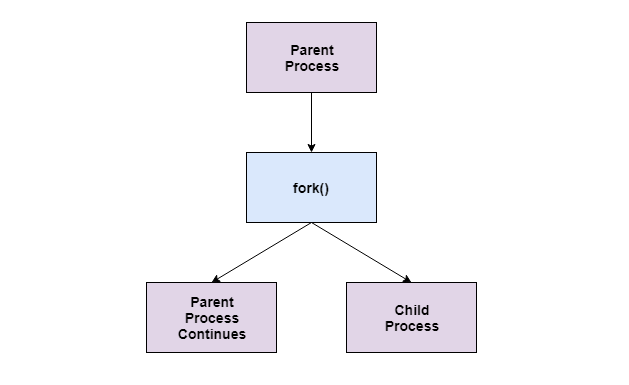
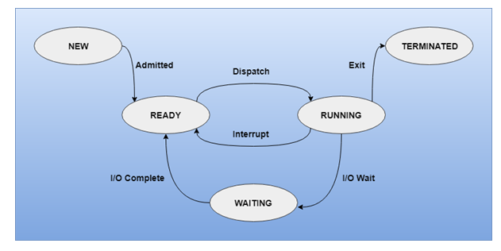
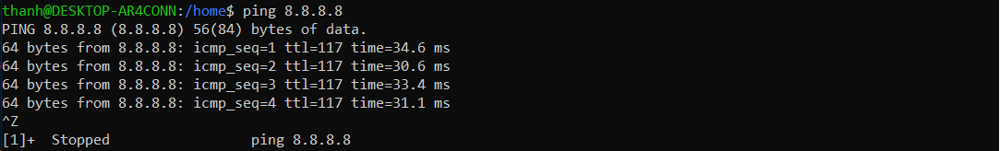
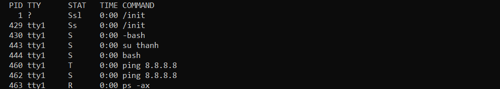
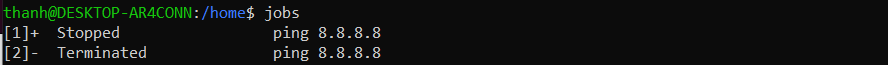
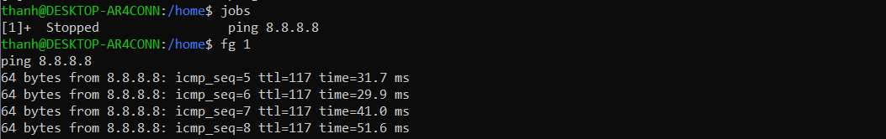
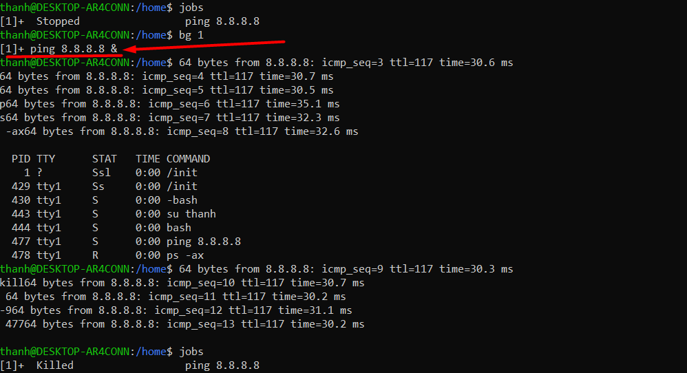

# Cơ chế chia sẽ thông tin giữa process trong Linux


# Mục lục

[1. Linux signal.](#1)

[2. Background và foreground process](#2)

---


Trong Linux, mỗi process sẽ có một không gian địa chỉ, vùng nhớ riêng. Điều này đồng nghĩa với việc một process không thể trực tiếp access hay thay đổi một process khác. Tuy nhiên, cũng có trường hợp ta muốn gửi thông tin qua lại giữa các process, khi đó ta phải lựa chọn dùng một số cơ chế được cung cấp sẵn bởi Linux, một số cơ chế thường được sử dụng:

- Pipe
- Signal
- Socket

## 1. Signal là gì?
Linux Signal là cơ chế đơn giản của Linux giúp ta gửi một số message được định nghĩa trước giữa kernel với process hoặc process với process. Kernel có thể gửi signal cho process khi có lỗi xảy ra, hoặc khi có một sự kiện nào đó(ví dụ khi user bấm Ctrl + C). Ngoài ra, giữa những process với nhau cũng có thể gửi nhận signal. Việc handle gửi/nhận giữa các process sẽ được kernel đảm nhiệm thông qua các system call(kill(2), sigaction(2), signal(7)). Có thể hiểu kernel sẽ giữ vai trò trung gian nhận yêu cầu gửi signal từ một process và gửi signal này đến process đích.


Trong Linux số lượng và ý nghĩa các signal thường ít thay đổi, dưới đây là danh sách một số signal thông dụng:

|Signal	|Value	|Comment
|--|--|--|
|SIGHUP	|1	|Hangup
|SIGINT	|2  |Interrupt from keyboard
|SIGQUIT	|3 |Quit from keyboard
|SIGKILL	|9	|Kill signal
|SIGTERM	|15	|Termination signal
|SIGUSR1	|30, 10, 16	|Custom signal 1
|SIGUSR2	|31, 12, 17	|Custom signal 2

## 2. Tiến trình trong linux.

Hệ thống sẽ không thực sự quản lý toàn bộ các chương trình, mà chỉ quản lý khi nó được thực thi. Một chương trình để có thể thực thi được trên bất cứ một hệ điều hành nào thì nó đều phải ở dạng mã máy, mỗi chương trình chưa rất nhiều các đoạn mã máy (hay mã chỉ dẫn) giúp cho máy tính có thể biết được chương trình sẽ làm gì. Các đoạn mã này sẽ được nạp vào bộ nhớ khi thực thi, được cấp phát vùng hoạt động, thời gian thực thi .... Và khi điều này xảy ra, thay vì gọi là chương trình, ta có một thuật ngữ khác là tiến trình. Và chính xác thì các tiến trình này là những thứ được quản lý bởi một hệ thống/hệ điều hành Linux (hoặc Windows hay OSX).


Trong process có các khái niệm đáng chú ý sau đây:

- Process cha: khi một chương trình chạy sẽ khởi động lệnh 1 tiến trình cha. Tiến trình cha này sẽ sử dụng  fork() để tạo các lời gọi hệ thống( system call) tạo ra các tiến trình con hoạt động dưới tiến trình cha.
    - Một tiến trình cha có thể sẽ có nhiều tiến trình con và 1 tiến trình con chỉ có 1 cha.

- Process con: Tiến trình con được tạo ra bới tiến trình cha bởi system call fork(). 
    - Tiến trình con được gọi là subprocess hoặc subtask.    
    - Tiến trình con được tạo ra sẽ thừa hưởng các thuộc tính của cha nó. Nếu tiến trình con không có cha thì nó đã được tạo ra bởi kernel.
    - Nếu tiến trình con đang hoạt động mà bị ngắt thì nó sẽ gửi SIGCHLD đên cho tiến trình cha.




Vòng đời của 1 tiến trình hoặc một chương trình.



Các tiến trình nhận tương tác từ người dùng thì hoạt động ở chế độ mặt trước (foreground).

Các tiến trình không nhận tương tác thì hoạt động ở chế độ nền (background).

Các tiến trình thường chuyển qua chuyển lại giữa hai trạng thái này trong quá trình hoạt động, việc chuyển trạng thái có thể thực hiện do người dùng, do lệnh từ shell hoặc do lập trình.


Khi một hệ thống đã vận hành, có rất nhiều chương trình đã và đang hoạt động cùng nhau, cùng phối hợp để khiến cho hệ thống có thể giúp người dùng xử lý các công việc. Các bản phân phối Linux cũng giống như các hệ điều hành hiện đại ngày nay, hoạt động theo cơ chế đa nhiệm, tức là trong cùng 1 thời điểm có thể có nhiều chương trình cùng (có vẻ) thực thi tại 1 thời điểm. Tất nhiên thực tế điều này không bao giờ xảy ra, các chương trình đã được phân chia thời gian hoạt động và hệ điều hành điều phối hoạt động tốt đến mức ta không nhận ra được các chương trình thực tế đang chạy tuần tự mà nghĩ rằng nó đang chạy song song.

Ngoài sự đa nhiệm, Linux còn hỗ trợ cơ chế đa người dùng, tức là tại 1 thời điểm, có thể có nhiều chương trình được hoạt động với người dùng là những người khác nhau. Hệ điều hành quản lý tất cả các tiến trình này và vẫn đảm bảo trải nghiệm là đồng đều giữa các người dùng cũng như giữa các chương trình. Một chương trình đặc biệt là top có thể giúp ta biết được hệ thống hiện tại có các chương trình nào đang hoạt động.


Xem các ví dụ sau đây để hiểu rõ thêm:

Khi ta gõ lệnh ping trên terminal thì nó sẽ là một process foregroud vì ta có thể tương tác với tiến trình này.
```
ping 8.8.8.8
```

Ta có thể sử dụng `ctrl + z` hoặc signal 2 để tạp dừng tiến trình.


Sau khi tạp đừng tiến trình tiến trình này sẽ được đưa từ foreground về dưới background. Sô thứ tự trong hàng đợi, bộ nhớ của tiến trình vẫn được giữ nguyên không mất đi.

Sử dụng tổ hợp `ctrl + c` để  gọi signal đóng tiến trình.


khi nhận được signal thì tiến trình kết thúc và tính toán rồi giải phòng hàng đợi, bộ nhớ của process

Đưa một process từ foregound vào backgound để chạy giống như 1 daemon thì t thêm ký tự `&` vào cuối câu lệnh.
```
ping 8.8.8.8 &
```

Sau đó sử dụng lệnh `ps -ax` để xem các tiến trình.


Như hình trên ta thây 2 tiến trình ping 460 đã được dừng đấu hiệu nhân biết là ở cột `STAT` có chữ T. Tiến trình 462 đang đưọc chạy dưới backgroung dấu hiệu là có chữ S ở cột STAT.


Lúc này tiến trình này đang được chạy và không tương tác. Muốn tắt, dừng tiến trình ta phải sử dụng các signal.
```
kill -9 462 để ngắt tiến trình
kill -2 462 để kết thức tiến trình
kill -15 462 để tiêu diệt tiến trình.
```


Bất cứ tiến trình nào dc tạm dừng hoặc bị tiêu diệt sẽ dc liệt kệ trong jobs.


Như ta có thể thấy tiến trình ping được tạm dừng từ lúc đầu nó vẫn còn trong hàng đợi jobs và tiến trình ping vừa tiêu diệt cũng dc liệt kê trong hàng dợi jobs. Khi tiến trình terminated đc hoàn tất nó sẽ dc xóa khỏi hàng đợi trong jobs.


Trong hàng đợi của jobs còn process thì ta có thể đưa process đoc từ background thành foreground và ngược lại.


Như hình trên ta thấy trong jobs có 1 tiến trình ping đang đc stop. Để đưa tiến trình ping này chạy trên foreground thì ta sử dụng câu lệnh.
`fg <sô thứ tự của tiến trình trong jobs>`

```
fg 1
```


Để đưa tiến trình ping này xuống  background process thì ta sử dụng câu lệnh. 

`bg <sô thứ tự của tiến trình trong jobs>`

```
bg 1
```


Lúc này câu lệnh đã dc thêm dấu `&` để được chạy trong background. Sư dụng SIGKILL để kết thúc tiến trình.


