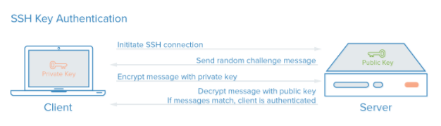
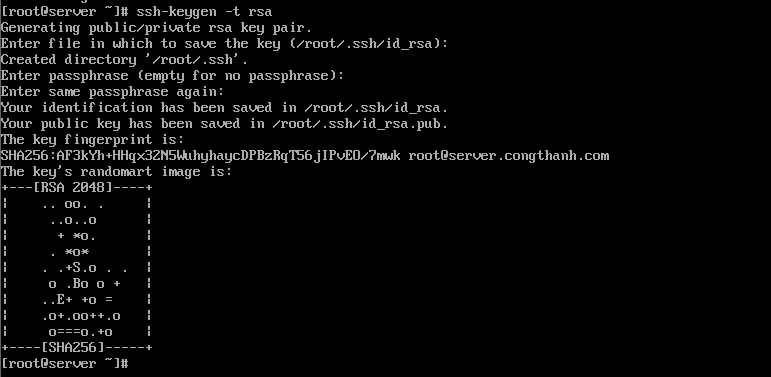
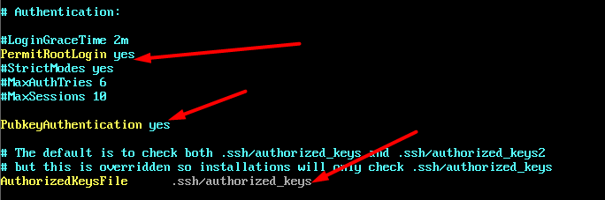
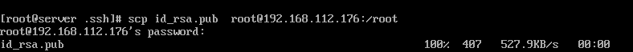
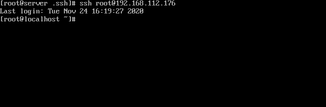

# Tìm hiểu SSH

## Mục lục

1. Giới thiệu

2. Cách thức hoạt động của SSH keys

3. Thực hành lab SSH

4. Cấu hình ssh chỉ sử dụng key pairs

5. Sử dụng cloud-init để chèn key pair cho máy ảo trên OpenStack

----------

## 1. Giới thiệu SSH.

SSH (secure shell) là một giao thức mã hóa dùng để quản trị và giao tiếp với servers. Khi làm việc với Linux server, bạn sẽ dành phần lớn thời gian của mình vào terminal được kết nối qua SSH.

Có một vài cách để SSH tới SSH server như dùng password hoặc keypair. Trong đó phương thức dùng keypair được cho là có tính bảo mật cao hơn bởi nếu trong quá trình sử dụng mà các gói tin của bạn bị bắt lại, các phiên trao đổi khóa giữa SSH server và client sẽ bị lộ và attacker có thể dùng nó để giải mã dữ liệu. Hơn nữa, việc này cũng tạo điều kiện cho các cuộc tấn công Brute Force mật khẩu.

SSH có ỗ trợ sử dụng cặp khóa Private Key và Public Key được chia sẻ với nhau từ trước. Nghĩa là bạn đã có sẵn Private Key để trao đổi với server mà không cần đến quá trình trao đổi khóa, điều này sẽ hạn chế khả năng bị bắt gói. Hơn nữa cặp khóa này còn có một mật khẩu riêng của nó, gọi là passphrase (hay keyphrase). Mật khẩu này được dùng để mở khóa Private Key (được hỏi khi bạn SSH vào server) và tạo lớp xác thực thứ 2 cho bộ khóa. Nghĩa là:
+ Nếu attacker không có Private Key, việc truy cập vào server gần như không thể, chỉ cần bạn giữ kĩ Private Key.
+ Tuy nhiên trong trường hợp Private Key bị lộ, bạn vẫn khá an toàn vì đối phương không có passphrase thì vẫn chưa thể làm được gì, tuy nhiên đó chỉ là tạm thời. Bạn cần truy cập server thông qua cách trực tiếp hoặc qua VNC của nhà cung cấp nếu đó là một VPS để thay đổi lại bộ khóa.

## 2. Cách thức hoạt động của SSH keys

SSH key pairs là một cặp khóa được mã hóa có thể được dùng để xác thực giữa client và server. Mỗi một cặp khóa sẽ có public key và private key. Private key được giữ ở phía client và phải được bảo mật tuyệt đối. Nếu có được private key, attackers hoàn toàn có thể truy cập vào server. Cũng vì thế nó được mã hóa với passphrase.

Public key có thể được chia sẻ và phân tán rộng rãi bởi nó được dùng để mã hóa các tin nhắn mà chỉ private key mới giải mã được. Public key sẽ được upload lên phía server và được lưu tại thư mục người dùng (~/.ssh/authorized_keys).

Khi có client muốn xác thực bằng SSH keys, server có thể test xem client đó có giữ private key hay không. Nếu client chứng minh được nó có private key thì kết nối có thể được thiết lập.

Hình dưới đây mô tả quá trình xác thực giữa server và client:


## 3. Thực hành lab SSH

Mô hình lab: client-server. Phía server chạy linux, phía client sử dụng windows hoặc linux.

### 3.1 Tạo khóa trên server

**Phía server**

Sử dụng câu lệnh sau để tạo 1 cặp ssh keys.

`ssh-keygen -t rsa`

Keys được tạo ra sẽ được lưu tại thư mục của user tạo keys, ví dụ bạn tạo keys bằng tài khoản root thì keys sẽ được lưu tại `/root/tên-file`

Sau khi gõ lệnh trên, bạn sẽ được yêu cầu nhập vào tên file chứa key và cả passphrase để mã hóa private key. Ví dụ ở đây mình tạo ra 1 cặp key `id_rsa.pub` và `id_rsa` bằng tài khoản root. Keys của mình sẽ được lưu tại `/root/.ssh/`.



Sau đó tiến hành phân quyền cho cặp key.
Lưu ý: nếu bạn không chỉnh sửa cấu hình ssh thì bạn phải chuyển public keys tới thư mục mặc định (~/.ssh/authorized_keys) thì server mới có thể xác nhận.

```sh
root@server:~# mkdir .ssh
root@server:~# mv /root/id_rsa.pub /root/.ssh/authorized_keys
root@server:~# chmod 600 /root/.ssh/authorized_keys
root@server:~# chmod 700 .ssh
```

Tiếp đến, hãy tiến hành cấu hình trong file `/etc/ssh/sshd_config` để khai báo thư mục đặt key cũng như cho phép user root login. Sau khi chỉnh sửa, tiến hành restart lại dịch vụ ssh.




**Phía client**

- Nếu bạn sử dụng hệ điều hành Linux, tiến hành copy private key vào và phân quyền cho private key (phải phân quyền là `600` vì mặc định là `644` thì key sẽ không được phép sử dụng)




Sau đó copy file public key vào trong thư mục mặc định `authorized-keys`. 

```
cp /root/id_rsa.pub /root/.ssh/authorized_keys
```

Sau đó dùng câu lệnh sau để ssh tới server dùng private key đã phân quyền:

`ssh root@192.168.112.176`




**Link tham khảo**

https://www.digitalocean.com/community/tutorials/how-to-configure-ssh-key-based-authentication-on-a-linux-server


https://www.digitalocean.com/community/tutorials/how-to-set-up-ssh-keys-2