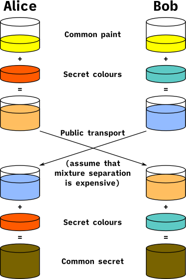
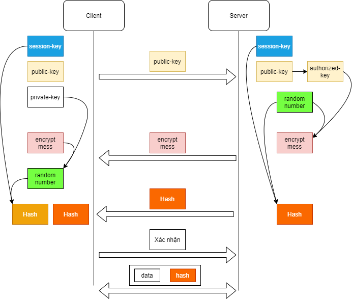

# **Tìm hiểu SSH và cách thức hoạt động**
## SSH là gì?
- SSH - Secure Shell: là một giao thức điều khiển từ xa cho phép người dùng kiểm soát và thao tác với server từ xa qua internet.
- SSH xử dụng mã hóa trong suôt quá trình truyền dữ liệu đảm báo tính bảo mật.
## SSH hoạt động?
- SSH hoạt động thông qua 3 bước:
    - Định danh host: xác định định danh của hệ thống tham gia phiên làm việc SSH.
    - Trao đổi khóa và mã hóa: Sử dụng thuật toán diffie-hellman thiết lập kênh làm việc mã hóa.
    - Xác thực người dùng: Sử dụng passworrd hoặc key-pair để xác thực người sử dụng có quyền đăng nhập hệ thống.
# Các kỹ thuật mã hóa khác nhau được sử dụng trong SSH.
- có 3 cách mã hóa qua SSH.
    - Symmetrical encryption.
    - Asymmetrical encryption.
    - Hashing.
## Symmetrical encryption
- Mã hóa đối xứng là một dạng mã hóa sử dụng khóa bí mật (secret key) ở cả hai chiều mã hóa và giải mã bởi cả host và client.
- Kiểu mã hóa này thì cả hai bên đề sử dụng một khóa chung để mã hóa và giải mã.
- Khi bên thứ ba biết được khóa sẽ có thể giải mã được bạn mã hóa gửi đi.
## Asymmetric encryption
- Mã hóa bất đối xứng sử dụng  hai khóa khác nhau để mã hóa và giải mã,tạo nên một cặp khóa là public-private key pair.
- Hai khóa là public key và private key.
    - Public key- khóa công khai: nó sẽ công khai ra bên ngoài
    - private key- khóa bí mật: luôn phải giữ bí mật. 
## Hashing
- Hàm băm( hashing) là một dạng mã hóa xử dụng trong secure shell connections.
- Hashing một chiều nó không được sinh ra để giải mã chúng tạo ra một giá trị duy nhất với độ dài nhất định cho mỗi lần nhập liệu mà không có hướng nào để khai thác.
- Có thể tạo ra một mã hóa hash từ 1 lần input nhưng không thể tạo ra lần input từ hash. Nếu client giữ đúng input đó và client có thể tạo ra một input giống như vậy và so sánh nó với giá trị đầu bên kia thì xác đinh cả hai bên.

# Các bước xác thực người dùng trong ssh.

## 3.1 Định danh người dùng.

Trên máy tính client bắt đầu khởi tạo một kết nối ssh đến server. Server nghe trên cổng 22. Khi đó sẽ có 2 trường hợp xảy ra.
- Nếu máy client kết nối lần đàu đến client sẽ hỏi server public key. Sau đó publiv key sẽ được lưu vào file `known_hosts` trong thư mục `~/.ssh`. Trong file  `known_hosts` chứa các thông tin xác thực server của client.
- Nếu client đã kết nối lần đầu thì nó sẽ tìm kiếm ID định danh trong file `known_hosts`.

## 3.2 Trao đổi khóa và mã hóa.
Sau khi xác định người dùng thì 2 máy tiến hành quá trình trao đổi khóa giữa 2 máy.

Quá trình này ta sử dụng giải thuật `Diffie-Hellman`. Giải thuật sử dụng để 2 máy có thể đóng góp tài nguyên để tạo ra 1 khóa chung.

Các bước thực hiện như sau:
- Bước 1: Trên cả 2 máy tính client và server sẽ tạo ra  một số nguyên ngẫu nhiên và một khóa bí mật.

- Bước 2: Từ khóa bí mật và sô nguyên ngẫu nhiên sẽ tạo ra mã khóa công khai.

- Bước 3: Sau khi tạo ra 2 khóa công khai 2 máy tính sẽ trao đổi 2 khóa công khai đó cho nhau. 

- Bước 4: Sau khi nhận khóa công khai của nhau 2 máy tính sẽ sử dụng khóa bí mật  để tạo ra một mã khóa mới gọi là session key.

Với kiểu kết nối ssh thông thường là sử dụng password. Đến bước này password sẽ được mã hóa và gửi cho server để giải mã và so sánh. Nếu  password đúng thì có thể truy cập.

Cách kết nối này sẽ không an toàn nếu hacker biết được khóa thì chúng cũng có thể giãi mã ra password của chúng ta. Vậy nên ta cần sử dụng SSH key pair

## 3.3 Xác thực người dùng.

Các bước làm như sau:
- Bước 1: Sau khi tạo đươc khóa Session key chung. trên máy client sẽ tạo ra 2 khóa là private key và public key.
- Bước 2: Client gửi file public key đến server.
- Bước 3: Máy tính server sẻ kiểm tra public key và lưu vào trong file authorized-key. Server kiểm tra xem trong file có ID của máy client hay không.
- Bước 4: Sau khi xác định được ID client server tiến hành tạo ra ngaau nhiện một sô nguyên( Random number). Sau đó máy server từ public key của client và sô random number sẽ tạo ra một thông tin mã hóa( encrypt mess). Gửi thông tin mã hóa cho máy tính client.
- Bước 5: Trên máy tính server tiếp tục sử dụng session key, sô random number và hàm băm MD5 để tạo ra đoạn mã hash. Đoạn mã này sử dụng để bảo vệ tính toàn vẹn của thông tin  khi gửi đi. Sau máy server gửi đoạn mã hash cho client.

- Bước 6: Trên client lúc này sẽ nhận được 2 đoạn mã là encrypt message và hass. Client sử dụng private key giả mã encryp message sẽ lấy được random number. Sau đó từ sô random number, session key và thuật toán hàm băm MD5 sẽ giải ra đoạn mã Hash. Client sẽ so sánh đoạn hash vừa tạo ra và đoạn mã vừa nhận được. Nếu trường hợp giống nhau thì đã xác định đúng server. Nếu không trùng thì sẽ bị reject.

- Bước 7: Kết thúc quá trình trao dổi xác thực người dùng. Tiếp đến tiến hành mã hóa thông tin và gửi thông tin.

Trên đây là toàn bộ quá trình tạo kết nối, trao đổi khóa và xác thực của SSH.