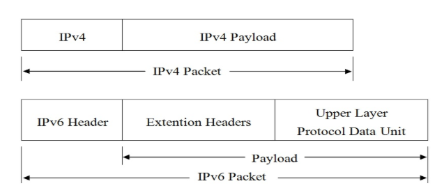
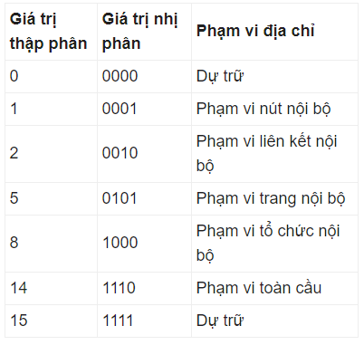

# Tìm hiểu về địa chỉ IPv6

## Mục lục
[1.IPv6 là gì?](#1)

[2. Ưu điểm so với IPv4](#2)

[3. Cấu trúc, phân chia bộ phận](#3)

[4. Các loại địa chỉ IPv6.](#4)

- [4.1 UNICAST](#4.1)
- [4.2 MULTICAST](#4.2)
- [4.3 ANYCAST](#4.3)

---

<a name="1"> </a>
## 1. IPv6 là gì?

IPv6 (internet protocol version 6) sử dụng 128 bit  là giao thức truyền thông cung cấp hệ thống đánh giá vị trí và định tuyến luu lượng các trên internet.

<a name="2"> </a>
## 2. Ưu điểm so với IPv4
- Không gian địac chỉ lớn 2^128 địa chỉ.
- Header được cải  thiện.
- Tự động cấu hình không trạng thái.
- Multicast tăng cường truyền thông hiệu quả.
- Jumbograms: hỗ trọ packet payload cực lớn hiệu quả.
- Bảo mật lớp mạng, mã hóa và xac thực truyền thông.
- Khả năng QoS ( quality of service) đánh dấu cho các gói tin và dán nhãn để xác định đường đi ưu tiên.
- Anycast. dịch vụ dự phòng có cấu truc đặc biệt.
- Tính di dộng dễ dàng xử lý vói thiết bị di đông hay chuyển vùng.


<a name="3"> </a>
## 3. Cấu trúc, phân chia bộ phận


Cấu trúc IPv6 gồm 2 phần:

- Payload: là sự kết hợp của Extension và PDU.Thông thường có thể lên tới 65535 byte. PDU thường bao gồm header của giao thức tầng cao và độ dài của nó, còn Extension là những thông tin liên quan đến dịch vụ kèm theo trong IPv6 được chuyển tới một trường khác và nó có thể có hoặc không.

- IPv6 Header: là thành phần luôn phải có trong một gói tin.IPv6 và cố định 40 bytes

    - Version: 4 bits giúp xác định phiên bản của giao thức.

    - Traffic class: 8 bits giúp xác định loại lưu lượng.

    - Flow label: 20 bits giá mỗi luồng dữ liệu.

    - Payload length: 16 bits (số dương).Giúp xác định kích thước phần tải theo sau IPv6 Header.

    - Next-Header: 8 bits giúp xác định Header tiếp theo trong gói  tin.

    - Hop Limit: 8 bits (số dương). Qua mỗi node, giá trị này giảm 1 đơn vị ( giảm đến 0 thì gói bị loại bỏ).

    - Source address: 128 bits mang địa chỉ IPv6 nguồn của gói tin.


Địa chỉ IPv6 bao gồm 8 hextet có dang: xxxx.xxxx.xxxx.xxxx.xxxx.xxxx.xxxx.xxxx

Ví dụ: 2001:0j68:0000:0000:0000:0000:1986:69af

Quy ước viết tắt địa chỉ IPv6:
- Dãy 4 chữ số 0 liên tục sẽ viết tắt với nhau bằng ": :".
- Các số 0 trong một nhóm có thể được bỏ qua. Nếu một khối 4 số bắt đầu của nó là số 0 thì số 0 này có thể được lược bỏ bớt để lại là 3 số 0 trong khối. Nếu khối ba số đó cũng lại bắt đầu với một số 0 đứng đầu thì ta có thể tiếp tục loại bỏ.
ví dụ:
    ```
    2001:0f68:0000:0000:0000:0000:1986:69af
    2001:f68:000:000:000:000:1986:69af
    2001:f68:00:00:00:00:1986:69af
    2001:f68:0:0:0:0:1986:69af
    2001:f68::1986:69af
    ```

Theo quy ước trên ta sẽ viết lại địa chỉ IPV6 như sau
`2001:j68::1986:69af`

- Truy cấp địa chỉ IPv6 qua web port 80 ta nhập sau 
http://[ địa chỉ IPv6 ] :  "port" /

- Địa chỉ IPv6 có 3 phần:
    - 3 octet đầu: 2001:0j68:0000 : là phần site prefix:  nó được gán đến trang của bạn bằng môi ISP , các máy tính trong một vị trí sẽ được chia sẻ cùng một site  prefix. Site prefix hướng tới dùng chung khi nó nhạn ra mạng của bạn và nó sẽ cho phép mạng có khả năng truy cập.

    - 1 octet tiếp theo :0000 : là phần subnet ID miêu tả cấu trúc của trang mạng, các mạng con làm việc với nhau, có độ dài 16 bytes.

    - 4 octet cuối :0000:0000:1986:69af : là phần interface ID nhận dạng  host riêng duy nhất trong mạng, được cấu hình dựa vào địa chỉ MAC của giao diện mạng  có thể cấu hình định dạng EUI-64


<a name="4"> </a>
# 4. Các loại địa chỉ IPv6
MULTICAST, UNICAST VÀ ANYCAST.

## 4.1 UNICAST
- Có 2 loại là unicast toàn cục và unicast liên kêt cục bộ.
- unicast toàn cục là có thể truy cập rộng rãi 
    - site prexit chiếm 48 bit
    - subnet ID chiếm 16 bit
- unicast liên kết cục bộ chỉ có thể truy cập tói các máy tính khác mà đã chia sẻ liên kết.
    - Site prefix được sử dụng bằng một địa chỉ Unicast liên kết cục bộ là: `fe80`.
    - có 128 byte chiều dài
        - site prexit chiếm 10 bit
        - subnet ID chiếm 64 bit
        - interface  ID dài 54 bit, bắt nguồn từ 48 bit địa chỉ MAC đã gán vào card mạng để giao thức phân rang giới

## 4.2 MULTICAST.

Mỗi một địa chỉ Multicast sử dụng một định dạng tiền tố là 11111111. Khi được biểu diễn trong ký hiệu hex và “:” thì một địa chỉ multicast luôn luôn bắt đầu bằng FF.

Bốn bit tiếp theo của địa chỉ Multicast là các bit cờ (flag). Tại thời điểm hiện tại, ba bit đầu trong nhóm bốn bit là không dùng đến (chính vì vậy chúng được thiết lập là 0). Bit cờ thứ tư được biết đến như một bit nốt đệm. Nhiệm vụ của nó là để biểu thị xem địa chỉ đó là một địa chỉ tạm thời hay thường xuyên. Nếu địa chỉ đó là địa chỉ thường xuyên thì bit này sẽ được gán bằng 0 còn ngược lại nó sẽ được gán bằng 1.

Bốn bit tiếp theo trong địa chỉ Multicast được biết đến như các bit ID Scope. Số lượng của không gian dự trữ cho các bit Scope ID là 4 bit, điều đó có nghĩa là có 16 giá trị khác nhau được biểu thị. Mặc dù không phải tất cả 16 giá trị đều được sử dụng tại thời điểm hiện tại, 7 trong số các giá trị đó được sử dụng để xác định phạm vi của địa chỉ. Ví dụ: nếu một địa chỉ có phạm vi toàn cầu thì địa chỉ là hợp lệ trên toàn bộ Internet. 

Hiện tại đã sử dụng các bit Scope ID như sau:


112 bit còn lại được sử dụng cho nhóm ID. Kích thước của nhóm ID cho phép các địa chỉ Multicast dùng hết 1/256 phần không gian địa chỉ của IPv6. 
- dùng nhận dạng một nhóm giao diện mạng. các giao diện mạng điển hình dc định vị trên các máy tính phức hợp nhưng ko phải là thiết bị thuần túy
- sử dụng gửi thông tin đến bất kỳ các mang giao diện nào

## 4.3 ANYCAST.
- là sự kết hợp các địa chỉ UNICAST và MULTICAST
- anycast gửi dũ liệu đến 1 người nhân cụ thể ở ngoài  nhóm người nhận
