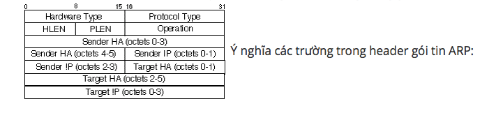
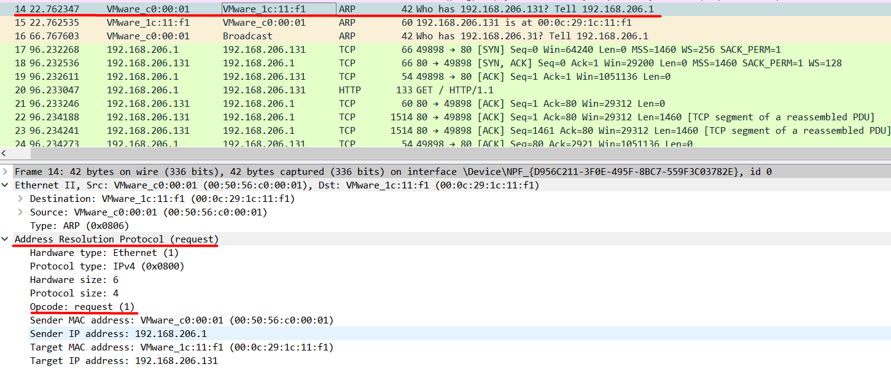
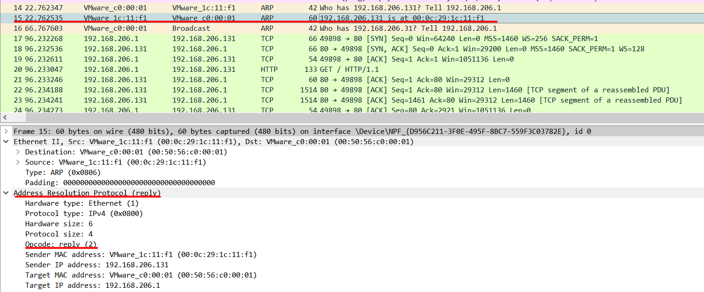
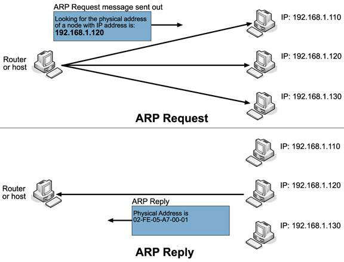
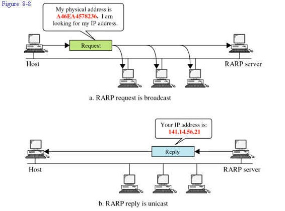

## Giao thức ARP

Đầu tiên chúng ta sẽ tìm hiểu làm thế nào để các máy tính trong một mạng LAN có thể gửi một gói tin đến đúng máy đích mong muốn. Ta đã biết mỗi một máy tính có một card mạng và sở hữu một địa chỉ MAC cố định và duy nhất. Và các card mạng trong một mạng LAN sẽ liên lạc với nhau thông qua địa chỉ này tại tầng Data-link của mô hình OSI.

Bên cạnh đó khi một máy tính được kết nối vào mạng LAN nó cũng được cấp phép một địa chỉ mang tính chất quy ước là IP, sử dụng ở tầng Network của mô hình OSI. Chúng ta hoàn toàn có thể tự thay đổi địa chỉ này theo ý muốn của mình. Bạn có thể hình dung địa chỉ MAC giống như địa chỉ nhà của mình dùng để nhận thư từ bưu phẩm, còn địa chỉ IP giống như tên của mình dùng để xưng hô khi giao tiếp với những người khác vậy.

Vấn đề đặt ra là làm sao để một máy tính A có thể biết được địa chỉ MAC của một máy tính B có địa chỉ IP là 192.168.1.120 để gửi gói tin cho nó? Ta phải có một cơ chế để chuyển đổi các dạng địa chỉ này qua lại với nhau. Từ đó ta có giao thức phân giải địa chỉ: Address Resolution Protocol (ARP). Dưới đây là cấu trúc gói tin sử dụng trong giao thức ARP.

 

- Hardware Type: xác định kiểu bộ giao tiếp phần cứng máy gửi cần biết với giá trị 1 cho Ethernet
- Protocol Type: Xác định kiểu giao thức địa chỉ cấp cao máy gửi cung cấp
- Có giá trị 080016 cho giao thức IP
    - HLEN: độ dài địa chỉ vật lý (bit)
    - PLEN: độ dài địa chỉ logic (bit)
        - 1: là một ARP request.
        - 2: là một ARP reply.
        - 3: là một RARP request.
        - 4: là một RARP reply.
    - Sender HA (sender hardware address): địa chỉ MAC của máy gửi
    - Sender Protocol Address: địa chỉ IP máy gửi
    - Target HA (target hardware address): địa chỉ MAC của máy nhận
    - Target Protocol Address: địa chỉ IP máy nhận

Sử dụng wireshark bắt gói tin ARP request.

Sử dụng wireshark bắt gói tin ARP reply.

Vậy cơ chế hoạt động của ARP ra sao?

 

Cách hoạt động của ARP.

- Bước 1: Thiết bị A sẽ kiểm tra cache của mình (giống như quyển sổ danh bạ nơi lưu trữ tham chiếu giữa địa chỉ IP và địa chỉ MAC). Nếu đã có địa chỉ MAC của IP 192.168.1.120 thì lập tức chuyển sang bước 9.

- Bước 2: Bắt đầu khởi tạo gói tin ARP Request. Nó sẽ gửi một gói tin broadcast đến toàn bộ các máy khác trong mạng với địa chỉ MAC và IP máy gửi là địa chỉ của chính nó, địa chỉ IP máy nhận là 192.168.1.120, và địa chỉ MAC máy nhận là ff:ff:ff:ff:ff:ff.

- Bước 3: Thiết bị A phân phát gói tin ARP Request trên toàn mạng. Khi switch nhận được gói tin broadcast nó sẽ chuyển gói tin này tới tất cả các máy trong mạng LAN đó.

- Bước 4: Các thiết bị trong mạng đều nhận được gói tin ARP Request. Máy tính kiểm tra trường địa chỉ Target Protocol Address. Nếu trùng với địa chỉ của mình thì tiếp tục xử lý, nếu không thì hủy gói tin.

- Bước 5: Thiết bị B có IP trùng với IP trong trường Target Protocol Address sẽ bắt đầu quá trình khởi tạo gói tin ARP Reply bằng cách:
    - lấy các trường Sender Hardware Address và Sender Protocol Address trong gói tin ARP nhận được đưa vào làm Target trong gói tin gửi đi.
    - Đồng thời thiết bị sẽ lấy địa chỉ MAC của mình để đưa vào trường Sender Hardware Address

- Bước 6: Thiết bị B đồng thời cập nhật bảng ánh xạ địa chỉ IP và MAC của thiết bị nguồn vào bảng ARP cache của mình để giảm bớt thời gian xử lý cho các lần sau (hoạt động cập nhật danh bạ).

- Bước 7: Thiết bị B bắt đầu gửi gói tin Reply đã được khởi tạo đến thiết bị A.

- Bước 8: Thiết bị A nhận được gói tin reply và xử lý bằng cách lưu trường Sender Hardware Address trong gói reply vào địa chỉ phần cứng của thiết bị B.

- Bước 9: Thiết bị A update vào ARP cache của mình giá trị tương ứng giữa địa chỉ IP (địa chỉ network) và địa chỉ MAC (địac chỉ datalink) của thiết bị B. Lần sau sẽ không còn cần tới request.

Như vậy máy A đã biết được địa chỉ MAC của máy B, tương tự như việc chúng ta đã biết địa chỉ cụ thể của ai đó. Và khi A cần gửi một gói tin cho B thì sẽ điền địa chỉ này vào trường Target Hardware Address. Gói tin sẽ được gửi thằng đến B mà không cần gửi đến các máy khác trong mạng LAN nữa.

 

## Giao thức RARP

Định Nghĩa : Giao thức RARP (Reverse Address ResolutionProtocol) hay còn gọi là giao thức phân giải địa chỉ ngược là một giao thức được sử dụng bởi một máy chủ yêu cầu giao thức Internet(IPv4) dùng để xác định địa chỉ IP (địa chỉ logic) từ địa chỉ MAC của thiết bị.

Mục Đích : Sử dụng giao thức RARP để tìm địa chỉ IP (Thực chất là việc ánh xạ cho Host một địa chỉ IP) khi đã biết địa chỉ vật lý (MAC) của Host.

 

 

Qúa trình thực hiện RARP được bắt đầu khi một máy muốn gửi đi một gói tin đến một máy khác, để làm được điều này trước tiên là máy đó phải xác định được địa chỉ IP của mình trong mạng. Như chúng ta đã biết việc gửi gói tin trong cùng một mạng thông qua Switch là dựa vào địa chỉ MAC tuy nhiên để biết được chúng có cùng trong cùng một mạng hay không thì cần xác định IP của mạng đó, RARP làm nhiệm vụ này.

Khi một máy trong mạng cục bộ gửi yêu cầu xác định địa chỉ IP từ cổng của máy chủ ARP (Address Resolution Protocol) thì chúng sẽ kiểm tra tại các bảng hoặc bộ nhớ đệm (Cache) tại đó. Một quản trị mạng (Network Administrator) có trách nhiệm tạo ra bảng tại cổng định hướng của mạng cục bộ này. Bảng này sẽ ánh xạ địa chỉ MAC của máy sang địa chỉ IP tương ứng.

Khái niệm RARP Server: Tất cả ánh xạ giữa địa vật lý (MAC) với địa chỉ logic(IP) của các Hosts được lưu trữ vào tệp cấu hình của một Host nào đó trong mạng. Host này được gọi là RARP Server. Host này đáp ứng tất cả các yêu cầu của RARP Request. Còn tệp cấu hình này nằm trên vùng đĩa cứng của RARP Server.

RARP Client : là một hệ thống máy tính không đĩa (Hosts), nơi phát ra các yêu cầu để xác định IP của Host với đầu vào là địa chỉ MAC.

Hoạt động:

- Khi một hệ thống không đĩa khởi động, nó phát đi một gói tin Broadcast yêu cầu RARP với địa chỉ MAC của nó. Gói tin này được nhận bởi tất cả các Hosts trong mạng. Khi RARP Server nhận được gói tin này nó nhìn lên địa chỉ MAC trong tệp cấu hình và xác định địa chỉ IP tương ứng. Sau đó nó gửi địa chỉ IP trong gói trả lời tin RARP (RARP Reply) và chỉ gửi từ một Host đến Host đích cần tới vì vậy gọi là gói Unicast. Hệ thống không đĩa ban đầu nhận được gói tin này và có được địa chỉ IP.

- Một gói tin RARP Request thường được được tạo ra trong quá trình khởi động của Host. Khi RARP Server nhận được gói RARPRequest, nó thực hiện các bước sau.

- Địa chỉ MAC trong gói tin yêu cầu được tìm kiếm trong tệp cấu hình, và được ánh xạ sang địa chỉ IP tương ứng .

- Nếu việc ánh xạ không tìm thấy thì gói tin sẽ bị loại.

- Nếu việc ánh được tìm thấy, một gói tin RARP Reply được tạo ra với địa chỉ MAC và IP của máy nguồn. Sau đó gói này được gửi trả lại Host mà đã đưa ra gói RARP Request.

- Lúc này khi Host nhận được RARP Reply, nó nhận được địa chỉ IP từ gói tin RARP ban đầu và hoàn tất quá trình khởi động (Boot), địa chỉ IP được sử dụng để giao tiếp với các 

- Hosts khác trong mạng cho đến khi nó khởi động lại.
Một số đặc điểm của giao thức RARP:

- Giao thức này xuất hiện đầu tiên trong việc giải quyết nhiệm vụ ánh xạ từ địa chỉ vật lý sang địa chỉ logic.
Sử dụng trong các hệ thống không có đĩa (DisklessWorkstation).

- Sử dụng nhiều trong các mạng LAN qui mô nhỏ, đặc biệt là trong mạng Ethernet .

- Hiện tại RARP không còn sử dụng nữa mà đã thay thế bằng giao thức khác đó là BOOTP và DHCP.

- RARP cùng với ARP nằm trên lớp DataLink Layer của mô hình OSI .