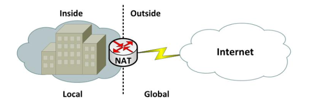
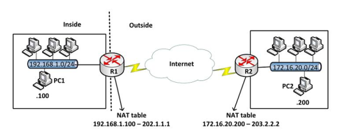
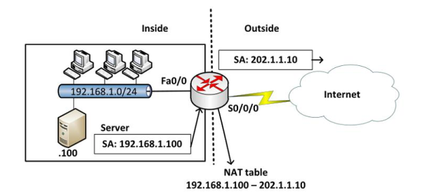
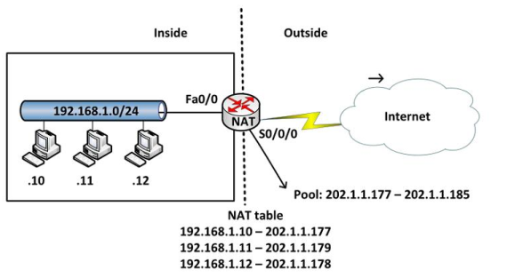
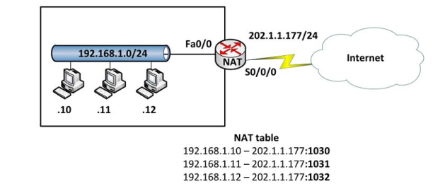

# Tìm hiểu NAT( Network Address Translation)

# Mục lục 

[1. Static NAT](#1)

- [ 1.1 Cấu hình static nat](#1.1)

[2. Dynamic NAT](#2)

- [2.1 Cấu hình dynamic nat](#2.1)

[3. NAT Overload](#3)

- [3.1 Cấu hình NAT overload ](#3.1)


---

Nat (Network Address Translation) là một kỹ thuật cho phép chuyển đổi từ một địa chỉ IP này thành một địa chỉ IP khác hay chuyển đổi địa chỉ nội miền thành địa chỉ ngoại miền. Thông thường, NAT được dùng phổ biến trong mạng sử dụng địa chỉ cục bộ, cần truy cập đến mạng công cộng (Internet). Vị trí thực hiện NAT là router biên kết nối giữa hai mạng.



## Địa chỉ private và địa chỉ public
Địa chỉ private:
- Địa chỉ private được định nghĩa trong RFC 1918

    - 10.0.0.0 - 10.255.255.255

    - 172.16.0.0 - 172.31.255.255

    - 192.168.0.0 - 192.168.255.255

Địa chỉ public:
- Là các địa chỉ còn lại. Các địa chỉ public là các địa chỉ được cung cấp bởi các tổ chức có thẩm quyền.


Một số thuật ngữ cần biết


- Địa chỉ inside local: là địa chỉ IP gán cho một thiết bị ở mạng bên trong. Địa chỉ này hầu như không phải địa chỉ được cung cấp bởi NIC (Network Information Center) hay nhà cung cấp dịch vụ.

- Địa chỉ inside global: là địa chỉ đã được đăng ký với NIC, dùng để thay thế một hay nhiều địa chỉ IP inside local.

- Địa chỉ outside local: là địa chỉ IP của một thiết bị bên ngoài khi nó xuất hiện bên trong mạng. Địa chỉ này không nhất thiết là địa chỉ được đăng ký, nó được lấy từ không gian địa chỉ bên trong.

- Địa chỉ outside global: là địa chỉ IP gán cho một thiết bị ở mạng bên ngoài. Địa chỉ này được lấy từ địa chỉ có thể dùng để định tuyến toàn cầu từ không gian địa chỉ mạng.


## <a name="1"> 1.Static Nat </a>
Static NAT được dùng để chuyển đổi một địa chỉ IP này sang một địa chỉ khác một cách cố định, thông thường là từ một địa chỉ cục bộ sang một địa chỉ công cộng và quá trình này được cài đặt thủ công, nghĩa là địa chỉ ánh xạ và địa chỉ ánh xạ chỉ định rõ ràng tương ứng duy nhất.

Static NAT rất hữu ích trong trường hợp những thiết bị cần phải có địa chỉ cố định để có thể truy cập từ bên ngoài Internet. Những thiết bị này phổ biến là những Server như Web, Mail,...



<a name ="1.1"></a>
### 1.1 Cấu hình Static NAT

Thiết lập mối quan hệ chuyển đổi giữa địa chỉ nội bộ bên trong và địa chỉ đại điện bên ngoài.

`Router (config) # ip nat inside source static [local ip] [global ip]`

Xác định các cổng kết nối vào mạng bên trong và thực hiện lệnh

`Router (config-if) # ip nat inside`

Xác định các cổng kết nối ra mạng công cộng bên ngoài thực hiện lệnh

`Router (config-if) # ip nat outside`

Ví dụ:


```
Router (config) # ip nat inside source static 192.168.1.100 202.1.1.10

Router (config) # interface fa0/0

Router (config-if) # ip nat inside

Router (config) # interface s0/0/0

Router (config-if) # ip nat outside
```

<a name ="2"></a>
## 2. Dynamic NAT

Dynamic NAT được dùng để ánh xạ một địa chỉ IP này sang một địa chỉ khác một cách tự động, thông thường là ánh xạ từ một địa chỉ cục bộ sang một địa chỉ được đăng ký. Bất kỳ một địa chỉ IP nào nằm trong dải địa chỉ IP công cộng đã được định trước đều có thể được gán một thiết bị bên trong mạng.



<a name ="2.1"></a>
### 2.1 Cấu hình Dynamic NAT
Xác định dải địa chỉ đại diện bên ngoài (public):các địa chỉ NAT

`Router (config) # ip nat pool [name start ip] [name end ip] netmask [netmask]/prefix-lenght [prefix-lenght]`

Thiết lập ACL cho phép những địa chỉ nội bộ bên trong nào được chuyển đổi: các địa chỉ được NAT

`Router (config) # access-list [access-list-number-permit] source [source-wildcard]`

Thiết lập mối quan hệ giữa địa chỉ nguồn đã được xác định trong ACL với dải địa chỉ đại diện ra bên ngoài.

`Router (config) # ip nat inside source list <acl-number> pool <name>`

Xác định các cổng kết nối vào mạng nội bộ

`Router (config-if) # ip nat inside`

Xác định các cổng kết nối ra bên ngoài

`Router (config-if) # ip nat outside`

Ví dụ: Cấu hình cho mô hình trong hình trên

```
Router (config) # ip nat pool abc 202.1.1.177 202.1.1.185 netmask 255.255.255.0

Router (config) # access-list 1 permit 192.168.1.0  0.0.0.255

Router (config) # ip nat inside source list 1 pool abc

Router (config) # interface fa0/0

Router (config-if) # ip nat inside

Router (config) # interface s0/0/0

Router (config-if) # ip nat outside
```

<a name ="3"></a>
## 3. NAT Overload
Nat Overload là một dạng của Dynamic NAT, nó thực hiện ánh xạ nhiều địa chỉ IP thành một địa chỉ (many - to - one) và sử dụng các địa chỉ số cổng khác nhau để phân biệt cho từng chuyển đổi. NAT Overload còn có tên gọi là PAT (Port Address Translation).

Chỉ số cổng được mã hóa 16 bit, do đó có tới 65536 địa chỉ nội bộ có thể được chuyển đổi sang một địa chỉ công cộng.




<a name ="3.1"></a>
### 3.1 Cấu hình NAT Overload
Xác định dãy địa chỉ bên trong cần chuyển dịch ra ngoài (private ip addresses range)

`Router (config) # access-list <ACL-number> permit <source> <wildcard>`

Cấu hình chuyển đổi địa chỉ IP sang cổng nối ra ngoài

`Router (config) # ip nat inside source list <ACL-number> interface <interface> overload`

Xác định các cổng nối vào mạng bên trong và nối ra mạng bên ngoài

Đối với các cổng nối vào mạng bên trong:

`Router (config-if) # ip nat inside`

Đối với nối ra mạng bên ngoài:

`Router (config-if) # ip nat outside`

Các lệnh kiểm tra cấu hình NAT
Hiển thị bảng NAT đang hoạt động

`R#show ip nat translation`

Hiển thị trạng thái hoạt động của NAT

`R#show ip nat statistics`

Xóa bảng NAT

`R#clear ip nat translation`

Kiểm tra hoạt động của NAT, hiển thị các thông tin chuyển đổi NAT bởi router.

`R#debug ip nat`

Tóm lại, Static NAT được sử dụng để ánh xạ địa chỉ theo kiểu “one-to-one” và được chỉ định bởi người quản trị. Dynamic NAT là kiểu chuyển dịch địa chỉ dạng “one-to-one” một cách tự động. NAT Overload là kiểu chuyển dịch địa chỉ dạng “many-to-one” một cách tự động, sử dụng các chỉ số cổng (port) để phân biệt cho từng chuyển dịch.