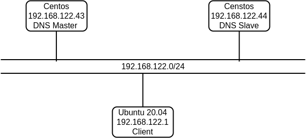
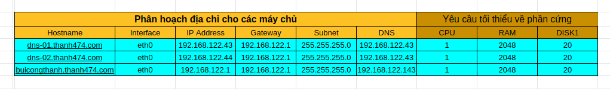
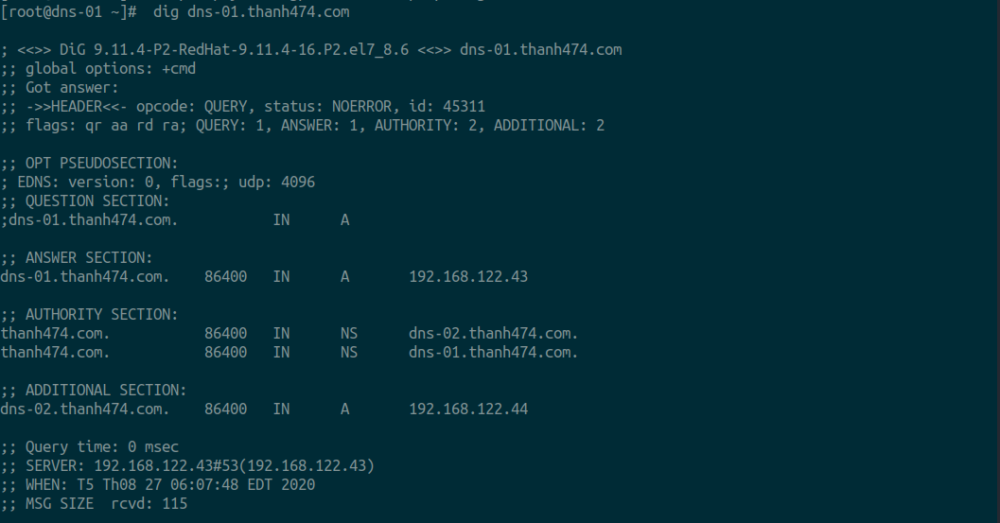
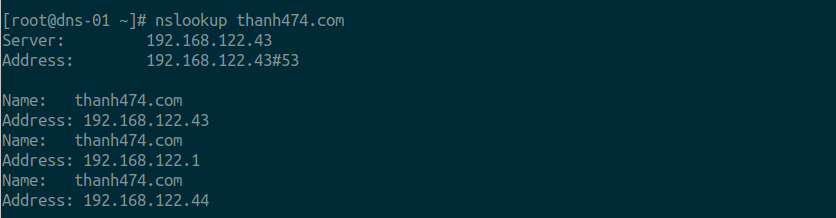
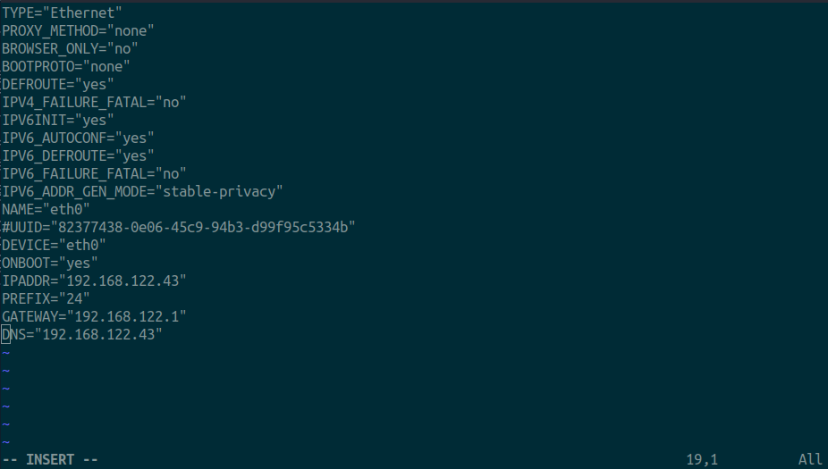
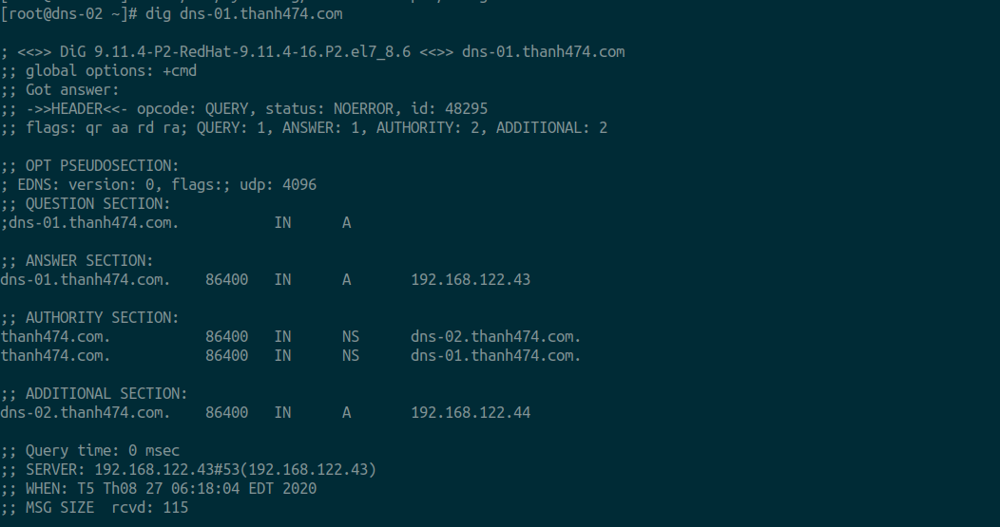
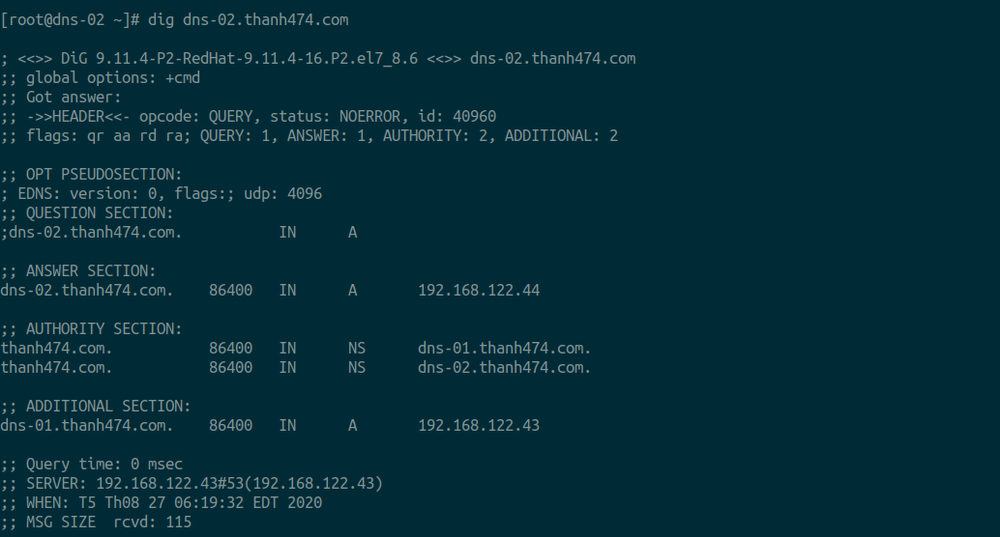

Bài hướng dẫn chi tiết này sẽ giúp bạn cách cài đặt và cấu hình dịch vụ DNS trên nền tảng CentOS 7. Hướng dẫn này cũng có thể được áp dụng với hệ điều hành Red Hat Linux và Scientific Linux 7.

Cài đặt môi trường cấu hình DNS.

Mô hình

 

IP planning

 

Cài đặt DNS Server Master :

Trước hết cần cài đặt gói bind vào máy :

    yum install bind bind-utils –y

Cấu hình DNS Server :

Tìm và Edit file ‘/etc/named.conf’

    vi /etc/named.conf

–  Thêm vào những dòng sau 13:
    listen-on port 53 { 127.0.0.1; 192.168.122.43;};

–  Thêm vào những dòng sau 21:

    allow-query     { localhost; 192.168.122.0/24;};
    allow-transfer  { localhost; 192.168.122.44;};

–  Thêm vào những dòng sau 60:
    zone "thanh474.com" IN {
    type master;
    file "forward.thanh474";
    allow-update {none; };
    };

    zone "122.168.192.in-addr.arpa" IN {
    type master;
    file "reverse.thanh474";
    allow-update { none; };
    };

Sau đó tiến hành tạo Zone File:

Tạo file forward.thanh474 trong thư mục ‘/var/named’ :

    vi /var/named/forward.thanh474

Thêm vào những dòng này :

    $TTL 86400

    @	 IN  SOA     dns-01.thanh474.com. root.thanh474.com. (

    2020082601  ;Serial

    3600        ;Refresh

    1800        ;Retry

    604800      ;Expire

    86400       ;Minimum TTL

    )

    @       IN  NS          dns-01.thanh474.com.

    @       IN  NS          dns-02.thanh474.com.

    @       IN  A           192.168.122.43

    @       IN  A           192.168.122.44

    @       IN  A           192.168.122.1

    dns-01       	IN  A   192.168.122.43

    dns-02		    IN  A   192.168.122.44

    buicongthanh    IN  A   192.168.122.1

Tạo vùng Reserve Zone :

Tạo file reserve.thanh474 ở trong thư mục ‘/var/named’ :

vi /var/named/reverse.thanh474 
Thêm vào những dòng sau :

    $TTL 86400

    @   IN  SOA     dns-01.thanh474.com. root.thanh474.com. (

    2020082601  ;Serial

    3600        ;Refresh

    1800        ;Retry

    604800      ;Expire

    86400       ;Minimum TTL

    )

    @       IN  NS          dns-01.thanh474.com.

    @       IN  NS          dns-02.thanh474.com.

    @       IN  PTR         thanh474.com.

    dns-01       IN  A   192.168.122.43

    dns-02   	 IN  A   192.168.122.44

    buicongthanh          IN  A   192.168.122.1

    1     IN  PTR         	dns-01.thanh474.com.

    2     IN  PTR        	dns-02.thanh474.com.

    3     IN  PTR       	buicongthanh.thanh474.com.

Khởi chạy dịch vụ DNS Server :

    systemctl enable named

    systemctl start named
Cấu hình Firewall :

–  Mở Port 53 trên Firewall để dịch vụ DNS có thể được thông qua :

    firewall-cmd --permanent --add-port=53/tcp

    firewall-cmd --permanent --add-port=53/udp
–  Restart lại Firewall để thay đổi có hiệu lực :

    firewall-cmd –reload
–  Cấu hình SELinux, Permissions, Ownership :

Chạy từng dòng lệnh theo thứ tự :

    chgrp named -R /var/named

    chown -v root:named /etc/named.conf

    restorecon -rv /var/named

    restorecon /etc/named.conf

–  Tiến hành Test thử DNS Server để đảm bảo không có lỗi :

Chạy dòng lệnh để check DNS Server :

    named-checkconf /etc/named.conf
Nếu dòng lệnh không có gì trả về, tức là bạn đã cấu hình đúng.

–  Check Forward Zone bằng dòng lệnh :

    named-checkzone thanh474.com /var/named/forward.thanh474

_ Kết quả trả về:
     
    zone thanh474.com/IN: loaded serial 2020082601
    
    OK

–  Check Reserve Zone bằng dòng lệnh :

    named-checkzone thanh474.com /var/named/reverse.thanh474
–  Kết quả trả về :

    zone thanh474/IN: loaded serial 2020082601

    OK

–  Tiến hành Add DNS Server vào file cấu hình card mạng :

    vim /etc/sysconfig/network-scripts/ifcfg-eth0

Thêm dong sau vào file.
    DNS="192.168.122.43"

Kêt quả file sau khi thêm:

–  Edit file /etc/resolv.conf,

    vi /etc/resolv.conf

–  Thêm vào địa chỉ IP của Name Server :

    nameserver      192.168.122.43

Save và đóng file.

–  Restart lại dịch vụ :

    systemctl restart network
–  Test DNS Server :

Chạy dòng lệnh :

    dig dns-01.thanh474.com

kiểm tra bằng nslookup

    nslookup thanh474.com

Vậy là DNS Server đã sẳn sàng để sử dụng. Chúng ta chuyển qua bước cấu hình DNS Server Slave.

–  Tại máy Secondary DNS, tiến hành chạy dòng lệnh để cài đặt gói bind :

yum install bind bind-utils –y
–  Cấu hình Slave DNS Server:

Mở file /etc/named.conf cấu hình thêm 1 sô dòng.

- Thêm vào dòng 13
    
    listen-on port 53 { 127.0.0.1; 192.168.122.44;};

- Thêm vào dòng 21

    allow-query     { localhost; 192.168.122.0/24;};

- Thêm vào dòng 58:

    zone "thanh474.com" IN {
    type slave;
    file "slaves/thanh474.fwd";
    masters {192.168.122.43; };
    };

    zone "122.168.192.in-addr.arpa" IN {
    type slave;
    file "slaves/thanh474.rev";
    masters {192.168.122.43; };
    };

–  Khởi động dịch vụ DNS:

    systemctl enable named

    systemctl start named
Bây giờ thì các vùng Forward và Reserve sẽ tự động đồng bộ từ DNS Master sang DNS Slave ở thư mục ‘/var/named/slaves/’:

ls /var/named/slaves/
–  Kết quả trả về sẽ được như sau :

    thanh474.fwd  thanh474.rev

–  Cấu hình Card mạng để thêm vào máy chủ DNS :

    vim /etc/sysconfig/network-scripts/ifcfg-eth0

Thêm vào dòng 19:

    Dns0="192.168.122.43"
    Dns1="192.168.122.44"

Sau khi thêm ta sẽ được file như sau

Mở và chỉnh sửa file /etc/resolv.conf

    vi /etc/resolv.conf
–  Thêm vào địa chỉ IP của Name Server :

    nameserver      192.168.122.43

    nameserver      192.168.122.44
Save và đóng file lại.

Cấu hình Firewall :

Cũng giống như máy DNS Master, bạn cần mở port 53 trên Firewall để DNS Service có thể đi qua :

    firewall-cmd --permanent --add-port=53/tcp
 

–  Restart Firewall bằng dòng lệnh :

firewall-cmd --reload
 

Cấu hình SELinux, Permission, Ownership :

    chgrp named -R /var/named

    chown -v root:named /etc/named.conf

    restorecon -rv /var/named

    restorecon /etc/named.conf
–  Tiến hành test DNS Server Master:

    dig dns-01.thanh474.com

Kiểm tra tiếp DNS Server Slave

    dig dns-02.thanh474.com

–  Phân giải thử tên miền :

    nslookup thanh474.com

–  Kết quả trả về :

 

Cấu hình máy con Client :

Đối với tất cả các máy con, add thong tin địa chỉ IP của các máy DNS Server vào file ‘/etc/resolv.conf’

vi /etc/resolv.conf
 

Thêm vào :

    nameserver 192.168.122.43

    nameserver 192.168.122.44
 

Tiến hành restart lại dịch vụ mạng hoặc reboot máy để thay đổi được áp dụng.

Test DNS Server bằng máy Client :

Bạn có thể tiến hành test DNS Server từ các máy con bằng cách sử dụng các dòng lệnh :

    dig dns-01.thanh474.com

    dig dns-02.thanh474.com

    dig buicongthanh.thanh474.com

    nslookup thanh474.com
Vậy là cả 2 máy DNS Server Master và Slave đều đã có thể hoạt động.