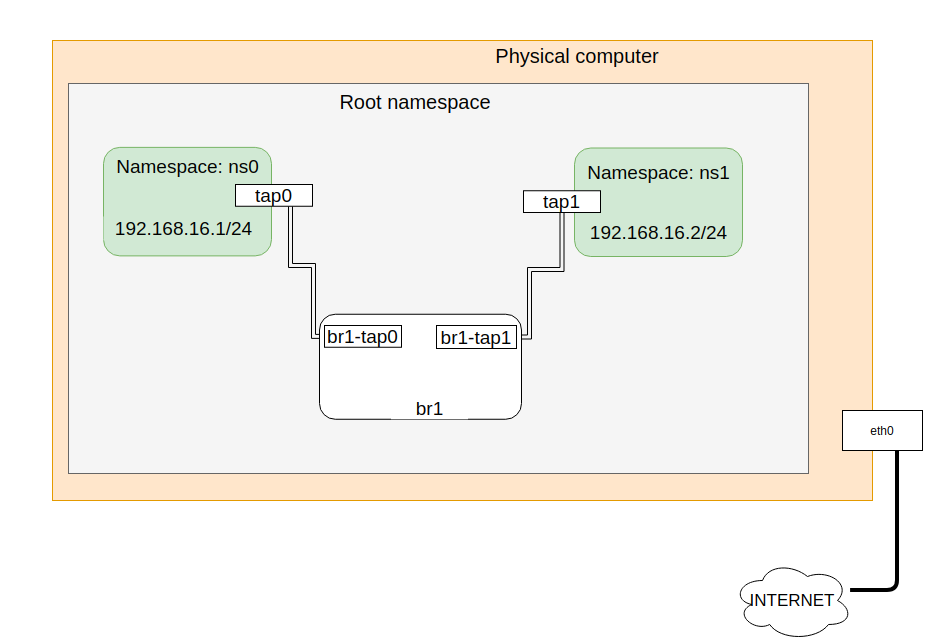

# Sử  Linux Bridge kết nối các namespace.

## Dùng 2 `veth pair` và 1 switch `linux bridge` để kết nối 2 namespaces

## Các bước làm
- Tạo 2 namespaces `ns0` và `ns1`
```
[root@congthanh ~]# ip netns add ns0
[root@congthanh ~]# ip netns add ns1
```
- Tạo `linux bridge` có thên là  `br1`
```
[root@congthanh ~]# brctl addbr br1
[root@congthanh ~]# brctl show
bridge name	bridge id		STP enabled	interfaces
br1		8000.000000000000	no	
```

- Tạo `port pair` có 1 đầu là `tap0` và 1 đầu là `br1-tap0`
```
[root@congthanh ~]# ip link add tap0 type veth peer name br1-tap0
[root@congthanh ~]# ip a
1: lo: <LOOPBACK,UP,LOWER_UP> mtu 65536 qdisc noqueue state UNKNOWN group default qlen 1000
    link/loopback 00:00:00:00:00:00 brd 00:00:00:00:00:00
    inet 127.0.0.1/8 scope host lo
       valid_lft forever preferred_lft forever
    inet6 ::1/128 scope host 
       valid_lft forever preferred_lft forever
2: ens3: <BROADCAST,MULTICAST> mtu 1500 qdisc noop state DOWN group default qlen 1000
    link/ether 52:54:00:cb:e6:86 brd ff:ff:ff:ff:ff:ff
3: br1: <BROADCAST,MULTICAST> mtu 1500 qdisc noop state DOWN group default qlen 1000
    link/ether 7e:34:3b:d3:6d:6a brd ff:ff:ff:ff:ff:ff
4: br1-tap0@tap0: <BROADCAST,MULTICAST,M-DOWN> mtu 1500 qdisc noop state DOWN group default qlen 1000
    link/ether e2:8d:74:15:2f:04 brd ff:ff:ff:ff:ff:ff
5: tap0@br1-tap0: <BROADCAST,MULTICAST,M-DOWN> mtu 1500 qdisc noop state DOWN group default qlen 1000
    link/ether aa:50:87:78:07:fb brd ff:ff:ff:ff:ff:ff
```

- Gán `br1-tap0` vào `br1`
```
[root@congthanh ~]# brctl addif br1 br1-tap0
[root@congthanh ~]# brctl show
bridge name	bridge id		STP enabled	interfaces
br1		8000.e28d74152f04	no		br1-tap0

```
- Gán `tap0` vào `ns0`
```
[root@congthanh ~]# ip link set tap0 netns ns0
[root@congthanh ~]# ip netns exec ns0 ip a
1: lo: <LOOPBACK> mtu 65536 qdisc noop state DOWN group default qlen 1000
    link/loopback 00:00:00:00:00:00 brd 00:00:00:00:00:00
5: tap0@if4: <BROADCAST,MULTICAST> mtu 1500 qdisc noop state DOWN group default qlen 1000
    link/ether aa:50:87:78:07:fb brd ff:ff:ff:ff:ff:ff link-netnsid 0

```

- Tạo `port pair` có 1 đầu là  `tap1` và một đầu là `br1-tap1`
```
[root@congthanh ~]# ip link add tap1 type veth peer name br1-tap1
[root@congthanh ~]# ip a
1: lo: <LOOPBACK,UP,LOWER_UP> mtu 65536 qdisc noqueue state UNKNOWN group default qlen 1000
    link/loopback 00:00:00:00:00:00 brd 00:00:00:00:00:00
    inet 127.0.0.1/8 scope host lo
       valid_lft forever preferred_lft forever
    inet6 ::1/128 scope host 
       valid_lft forever preferred_lft forever
2: ens3: <BROADCAST,MULTICAST> mtu 1500 qdisc noop state DOWN group default qlen 1000
    link/ether 52:54:00:cb:e6:86 brd ff:ff:ff:ff:ff:ff
3: br1: <BROADCAST,MULTICAST> mtu 1500 qdisc noop state DOWN group default qlen 1000
    link/ether e2:8d:74:15:2f:04 brd ff:ff:ff:ff:ff:ff
4: br1-tap0@if5: <BROADCAST,MULTICAST,UP,LOWER_UP> mtu 1500 qdisc noqueue master br1 state UP group default qlen 1000
    link/ether e2:8d:74:15:2f:04 brd ff:ff:ff:ff:ff:ff link-netnsid 0
    inet6 fe80::e08d:74ff:fe15:2f04/64 scope link 
       valid_lft forever preferred_lft forever
6: br1-tap1@tap1: <BROADCAST,MULTICAST,M-DOWN> mtu 1500 qdisc noop state DOWN group default qlen 1000
    link/ether be:69:15:f5:3a:18 brd ff:ff:ff:ff:ff:ff
7: tap1@br1-tap1: <BROADCAST,MULTICAST,M-DOWN> mtu 1500 qdisc noop state DOWN group default qlen 1000
    link/ether ee:48:7b:e0:f9:07 brd ff:ff:ff:ff:ff:ff

```
- Gán `br1-tap1` vào `br1`
```
[root@congthanh ~]# brctl addif br1 br1-tap1
[root@congthanh ~]# brctl show
bridge name	bridge id		STP enabled	interfaces
br1		8000.be6915f53a18	no		br1-tap0
							br1-tap1
```

- Gán `tap1` vào `ns1`
```
[root@congthanh ~]# ip link set tap1 netns ns1
[root@congthanh ~]# ip netns exec ns1 ip a
1: lo: <LOOPBACK> mtu 65536 qdisc noop state DOWN group default qlen 1000
    link/loopback 00:00:00:00:00:00 brd 00:00:00:00:00:00
7: tap1@if6: <BROADCAST,MULTICAST> mtu 1500 qdisc noop state DOWN group default qlen 1000
    link/ether ee:48:7b:e0:f9:07 brd ff:ff:ff:ff:ff:ff link-netnsid 0
```

Sau khi cấu hình ta được mô hình sau:



- Set port `tap0` up và gán ip cho tap0
```
[root@congthanh ~]# ip netns exec ns0 ifconfig tap0 up
[root@congthanh ~]# ip netns exec ns0 ip a add 192.168.16.1/24 dev tap0
[root@congthanh ~]# ip netns exec ns0 ip a 
1: lo: <LOOPBACK> mtu 65536 qdisc noop state DOWN group default qlen 1000
    link/loopback 00:00:00:00:00:00 brd 00:00:00:00:00:00
5: tap0@if4: <NO-CARRIER,BROADCAST,MULTICAST,UP> mtu 1500 qdisc noqueue state LOWERLAYERDOWN group default qlen 1000
    link/ether aa:50:87:78:07:fb brd ff:ff:ff:ff:ff:ff link-netnsid 0
    inet 192.168.16.1/24 scope global tap0
       valid_lft forever preferred_lft forever
```

- Set port `tap1` up và gán ip cho `tap1`
```
[root@congthanh ~]# ip netns exec ns1 ifconfig tap1 up
[root@congthanh ~]# ip netns exec ns1 ip a add 192.168.16.2/24 dev tap1
[root@congthanh ~]# ip netns exec ns1 ip a 
1: lo: <LOOPBACK> mtu 65536 qdisc noop state DOWN group default qlen 1000
    link/loopback 00:00:00:00:00:00 brd 00:00:00:00:00:00
7: tap1@if6: <NO-CARRIER,BROADCAST,MULTICAST,UP> mtu 1500 qdisc noqueue state LOWERLAYERDOWN group default qlen 1000
    link/ether ee:48:7b:e0:f9:07 brd ff:ff:ff:ff:ff:ff link-netnsid 0
    inet 192.168.16.2/24 scope global tap1
       valid_lft forever preferred_lft forever
[root@congthanh ~]# 

```

- Kiểm tra ping thông giữa 2 ns
```
[root@congthanh ~]# ip netns exec ns0 ping 192.168.16.2
PING 192.168.16.2 (192.168.16.2) 56(84) bytes of data.
64 bytes from 192.168.16.2: icmp_seq=1 ttl=64 time=0.172 ms
64 bytes from 192.168.16.2: icmp_seq=2 ttl=64 time=0.128 ms
64 bytes from 192.168.16.2: icmp_seq=3 ttl=64 time=0.109 ms
^C
--- 192.168.16.2 ping statistics ---
3 packets transmitted, 3 received, 0% packet loss, time 2003ms
rtt min/avg/max/mdev = 0.109/0.136/0.172/0.028 ms
```

__Docs__
- https://github.com/khanhnt99/thuctap012017/blob/master/XuanSon/Virtualization/Linux_Network_Namespaces/Linux_Network_Namespaces.md#3.2
