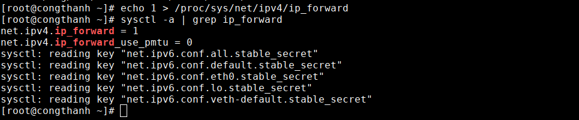

# Cấu hình các namespace có thể kết nối ra internet.

## Đề bài: 


- Tạo 3 namespace trong root namespace.
- Cấu hình 1 namespace kết nối ra mạng sử dụng iptables.
- Tạo các veth để kết nối các namespace.
- Cấu hình route tĩnh để các namespace nhìn thấy nhau.
- Sử dụng iptable để các namespace mới có thể kết nối ra internet thông qua namespace vừa cấu hình( namespace vừa cấu hình có chức năng như một gateway)

## Mô hình:


## Các bước thực hiện 

### Tạo ns0 và kết nối đến internet

Thêm namespace ns0
```
ip netns add ns0
```
Tạo đường veth đầu veth-ns0 và đầu veth-default
```
ip link  add veth-ns0 type veth peer name veth-default
```
Add các đầu vào namespace
```
ip link set veth-ns0 netns ns0
```
đầu veth-default sẽ dc nat với card mạng vật lý.

Tiếp đến gắn ip cho các veth port.
```
ip addr add 10.0.3.1/24 dev veth-default
ip netns exec ns0 ip addr add 10.0.3.2/24 dev veth-ns0
```

Up các veth port
```
ip link set veth-default up 
ip  netns exec ns0 ip link set veth-ns0 up
```

Kiểm tra ping veth pair.


Cấu hình ip_forward và iptables để ns0 kết nối dc  internet.
```
echo 1 > /proc/sys/net/ipv4/ip_forward
```
Kiểm tra xem đã forward chưa
```
sysctl -a | grep ip_forward
```


Tiếp đến cấu hình iptables trên máy tính vật lý đề nat giữa dải trong namespace ns0 và dải của card vật lý.
```
iptables -A FORWARD -o eth0 -i veth-default -j ACCEPT
iptables -A FORWARD -i eth0 -o veth-default -j ACCEPT
iptables -t nat -A POSTROUTING -s 10.0.3.2/24 -o eth0 -j MASQUERADE
```

Sau đó trỏ default route của ns0 đên veth-ns0

```
ip netns exec ns0 ip route add default via 10.0.3.1
```
Kiểm tra kết quả xem ns0 đã kêt nối dc internet.


## Thêm 2 namespace và kết nối đên internet thông qua namespace đó.

Tạo namespace ns1 và ns2
```
ip netns add ns1
ip netns add ns2
```

Tạo veth kết nối 2 namespace với ns0
```
ip link add veth-ns01 type veth peer name veth-ns1
ip link add veth-ns02 type veth peer name veth-ns2
```

Găn các interface vào các namespace
```
ip link set veth-ns1 netns ns1
ip link set veth-ns2 netns ns2
ip link set veth-ns01 netns ns0
ip link set veth-ns02 netns ns0
```
Đặt địa chỉ ip cho các interface

```
ip -n ns1 addr add 192.168.15.2/24 dev veth-ns1
ip -n ns2 addr add 192.168.16.2/24 dev veth-ns2
ip -n ns0 addr add 192.168.15.1/24 dev veth-ns01
ip -n ns0 addr add 192.168.16.1/24 dev veth-ns02
```


Bật các interface.
```
ip -n ns1 link set veth-ns1 up
ip -n ns2 link set veth-ns2 up 
ip -n ns0 link set veth-ns01 up 
ip -n ns0 link set veth-ns02 up
```

Vì sử dụng namespace ns0 là `gateway` nên ta sẽ cấu hình `ip_forward` và `iptables` trên namespace ns0

```
ip netns exec ns0 echo 1 > /proc/sys/net/ipv4/ip_forward
```
Kiểm tra bằng lệnh 
```
ip netns exec ns0 sysctl -a | grep ip_forward
```

Tiếp đến ta sẽ cấu hình iptables forward các gói tin giữa các port trong namespace ns0
```
ip netns exec ns0 iptables -A FORWARD -i veth-ns01 -o veth-ns0 -j ACCEPT
ip netns exec ns0 iptables -A FORWARD -o veth-ns01 -i veth-ns0 -j ACCEPT
ip netns exec ns0 iptables -A FORWARD -i veth-ns02 -o veth-ns0 -j ACCEPT
ip netns exec ns0 iptables -A FORWARD -o veth-ns02 -i veth-ns0 -j ACCEPT
```

Cấu hình chain nat từ ns1 sang ns0
```
ip netns exec ns0 iptables -t nat -A POSTROUTING -s 192.168.15.2/24 -o veth-ns0 -j MASQUERADE
ip netns exec ns0 iptables -t nat -A POSTROUTING -s 192.168.16.2/24 -o veth-ns0 -j MASQUERADE
```

Cấu hình default route từ ns1 trỏ đến veth-ns01
```
ip netns exec ns1 ip route add default via 192.168.15.1
ip netns exec ns2 ip route add default via 192.168.16.1
```

Kiểm tra lại kết quả :
- Ping từ ns1 ra internet:

- Ping từ ns2 ra internet:


Như vậy ta đã cấu hình thành công yêu cầu của đề bài.


