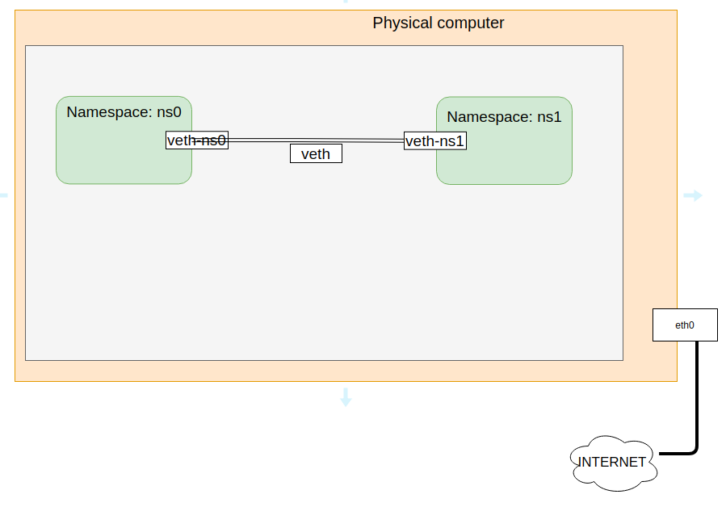
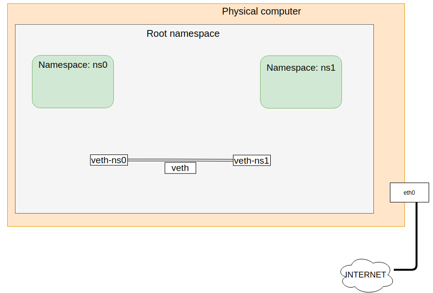
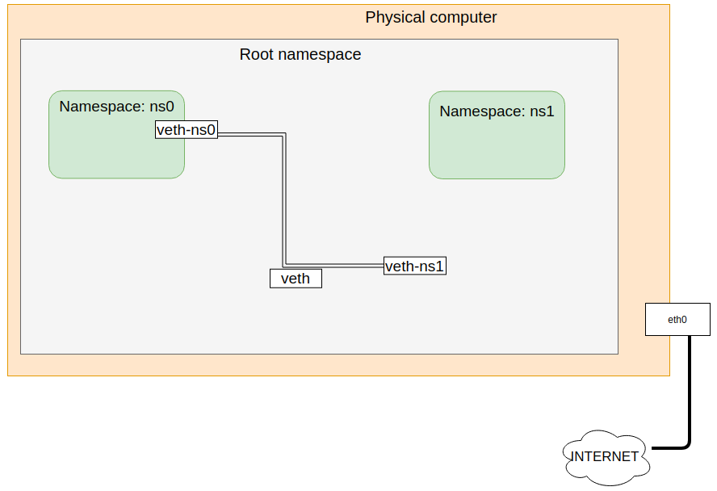
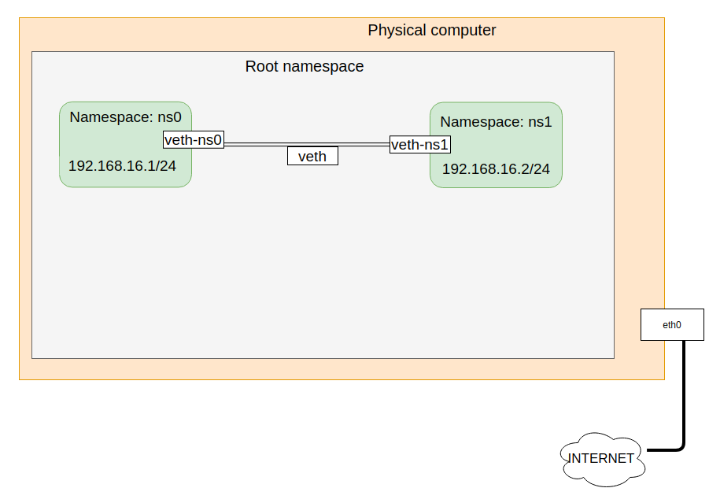

# Veth Pair

Để kết nối các namespace tới swtich, sử dụng veth pairs.

Virtual Ethernet interfaces (hay veth) là một kiến trúc thú vị, chúng luôn có 1 cặp, và được sử dụng để kết nối như một đường ống: các lưu lượng tới từ một đầu veth và được đưa ra, peer tới giao diện veth còn lại. Như vậy, có thể dùng veth để kết nối mạng trong namespace từ trong ra ngoài root namespace trên các interface vật lý của root namespace.

Veth là một loại kiểu kết nối mà luôn luôn đi theo 1 cặp (pairs). Có thể tưởng tượng rằng, từ pair nhắc đến ở đây như là một cái ống: mọi thứ gửi đến một đầu ống sẽ đi ra ngoài ở đầu bên kia.




## Các bước làm
- Tạo 2 `network namespaces` **ns0** và **ns1**

```
[root@congthanh ~]# ip netns add ns0
[root@congthanh ~]# ip netns add ns1
[root@congthanh ~]# ip netns
ns1
ns0
```

- Tạo 2 `veth pair` **veth-ns0** và **veth-ns1**
```
[root@congthanh ~]# ip link add veth-ns0 type veth peer name veth-ns1
[root@congthanh ~]# ip a
1: lo: <LOOPBACK,UP,LOWER_UP> mtu 65536 qdisc noqueue state UNKNOWN group default qlen 1000
    link/loopback 00:00:00:00:00:00 brd 00:00:00:00:00:00
    inet 127.0.0.1/8 scope host lo
       valid_lft forever preferred_lft forever
    inet6 ::1/128 scope host 
       valid_lft forever preferred_lft forever
2: eth0: <BROADCAST,MULTICAST,UP,LOWER_UP> mtu 1500 qdisc fq_codel state UP group default qlen 1000
    link/ether 52:54:00:cb:e6:86 brd ff:ff:ff:ff:ff:ff
    inet 192.168.122.149/24 brd 192.168.122.255 scope global eth0
       valid_lft forever preferred_lft forever
    inet6 fe80::5054:ff:fecb:e686/64 scope link 
       valid_lft forever preferred_lft forever
3: veth-ns1@veth-ns0: <BROADCAST,MULTICAST,M-DOWN> mtu 1500 qdisc noop state DOWN group default qlen 1000
    link/ether 0a:3e:7f:02:e9:e5 brd ff:ff:ff:ff:ff:ff
4: veth-ns0@veth-ns1: <BROADCAST,MULTICAST,M-DOWN> mtu 1500 qdisc noop state DOWN group default qlen 1000
    link/ether 9e:81:ae:82:17:f8 brd ff:ff:ff:ff:ff:ff
```

- Gắn interface `veth-ns0` vào namespace `ns0`.
```
[root@congthanh ~]# ip link set veth-ns0 netns ns0
```


- Gắn interface `veth-ns1` vào namespaces `ns1`
```
[root@congthanh ~]# ip link set veth-ns1 netns ns1
```


Có 2 device đi theo một cặp: mọi thứ khi được gửi đến veth-ns1@veth-ns0 sẽ đi ra ở veth-ns0@veth-ns1.


```
[root@congthanh ~]# ip netns exec ns0 ip a
1: lo: <LOOPBACK> mtu 65536 qdisc noop state DOWN group default qlen 1000
    link/loopback 00:00:00:00:00:00 brd 00:00:00:00:00:00
4: veth-ns0@if3: <BROADCAST,MULTICAST> mtu 1500 qdisc noop state DOWN group default qlen 1000
    link/ether 9e:81:ae:82:17:f8 brd ff:ff:ff:ff:ff:ff link-netnsid 1
```
```
[root@congthanh ~]# ip netns exec ns1 ip a
1: lo: <LOOPBACK> mtu 65536 qdisc noop state DOWN group default qlen 1000
    link/loopback 00:00:00:00:00:00 brd 00:00:00:00:00:00
3: veth-ns1@if4: <BROADCAST,MULTICAST> mtu 1500 qdisc noop state DOWN group default qlen 1000
    link/ether 0a:3e:7f:02:e9:e5 brd ff:ff:ff:ff:ff:ff link-netnsid 0
```

- **Up** 2 interface `veth-ns0` và `veth-ns1`
 
```
[root@congthanh ~]# ip -n ns0 link set veth-ns0 up
[root@congthanh ~]# ip -n ns1 link set veth-ns1 up
```

- Gán địa chỉ IP cho `veth-ns0` và `veth-ns1`
```
[root@congthanh ~]# ip netns exec ns0 ip a add 192.168.16.1/24 dev veth-ns0
[root@congthanh ~]# ip netns exec ns1 ip a add 192.168.16.2/24 dev veth-ns1
```

```
[root@congthanh ~]# ip netns exec ns0 ip a
1: lo: <LOOPBACK> mtu 65536 qdisc noop state DOWN group default qlen 1000
    link/loopback 00:00:00:00:00:00 brd 00:00:00:00:00:00
4: veth-ns0@if3: <BROADCAST,MULTICAST,UP,LOWER_UP> mtu 1500 qdisc noqueue state UP group default qlen 1000
    link/ether 9e:81:ae:82:17:f8 brd ff:ff:ff:ff:ff:ff link-netnsid 1
    inet 192.168.16.1/24 scope global veth-ns0
       valid_lft forever preferred_lft forever
    inet6 fe80::9c81:aeff:fe82:17f8/64 scope link 
       valid_lft forever preferred_lft forever
```

```
[root@congthanh ~]# ip netns exec ns1 ip a
1: lo: <LOOPBACK> mtu 65536 qdisc noop state DOWN group default qlen 1000
    link/loopback 00:00:00:00:00:00 brd 00:00:00:00:00:00
3: veth-ns1@if4: <BROADCAST,MULTICAST,UP,LOWER_UP> mtu 1500 qdisc noqueue state UP group default qlen 1000
    link/ether 0a:3e:7f:02:e9:e5 brd ff:ff:ff:ff:ff:ff link-netnsid 0
    inet 192.168.16.2/24 scope global veth-ns1
       valid_lft forever preferred_lft forever
    inet6 fe80::83e:7fff:fe02:e9e5/64 scope link 
       valid_lft forever preferred_lft forever
```

- Ping giữa veth-ns0 và veth-ns1
```
[root@congthanh ~]# ip netns exec ns0 ping 192.168.16.2
PING 192.168.16.2 (192.168.16.1) 56(84) bytes of data.
64 bytes from 192.168.16.2: icmp_seq=1 ttl=64 time=0.298 ms
64 bytes from 192.168.16.2: icmp_seq=2 ttl=64 time=0.105 ms
64 bytes from 192.168.16.2: icmp_seq=3 ttl=64 time=0.106 ms
^C
--- 192.168.16.2 ping statistics ---
3 packets transmitted, 3 received, 0% packet loss, time 2003ms
rtt min/avg/max/mdev = 0.105/0.169/0.298/0.091 ms
```

__Docs__
- https://github.com/khanhnt99/thuctap012017/blob/master/XuanSon/Virtualization/Linux_Network_Namespaces/Linux_Network_Namespaces.md